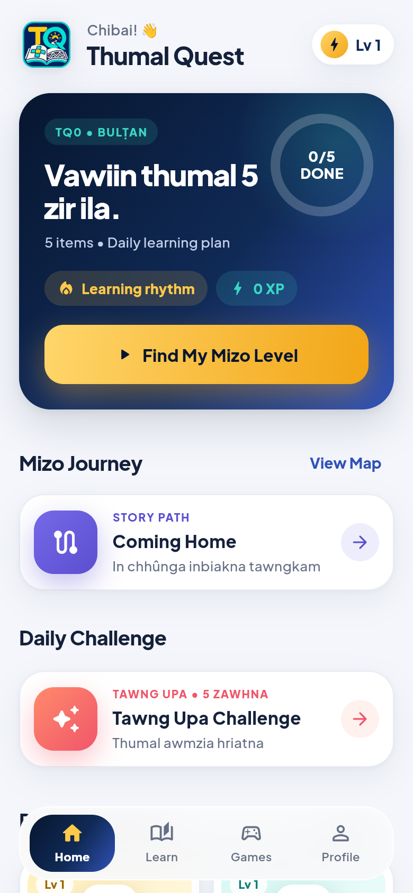
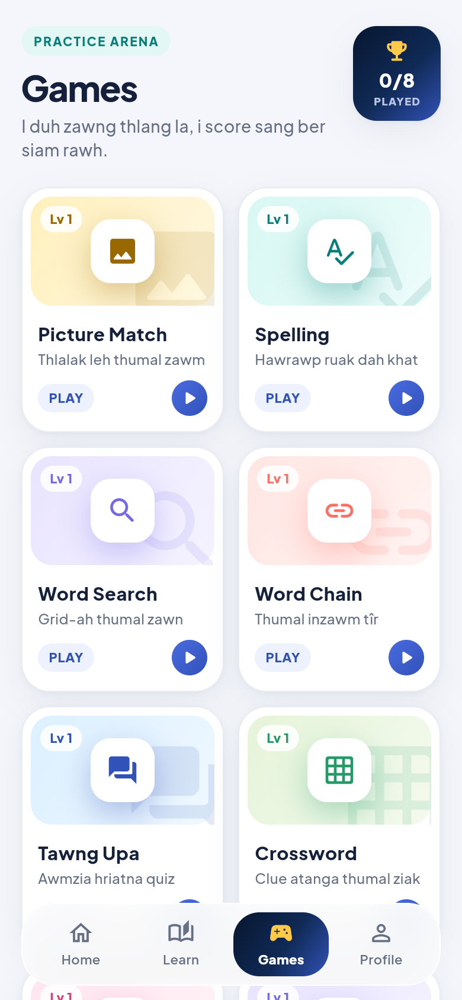
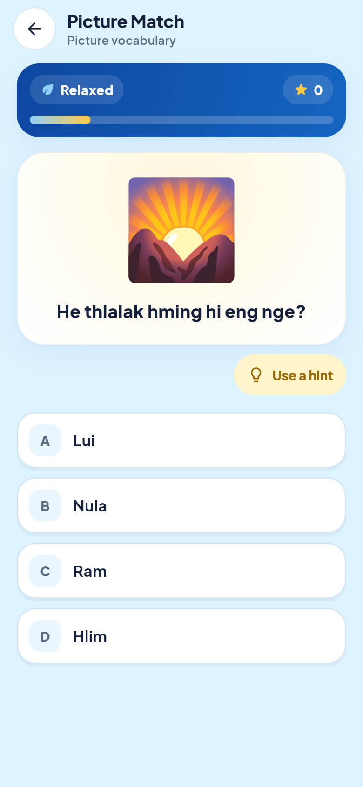
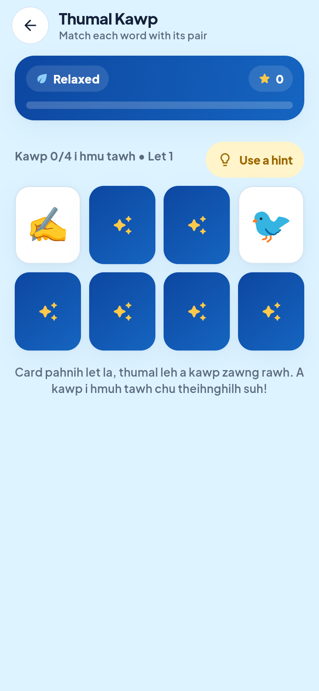
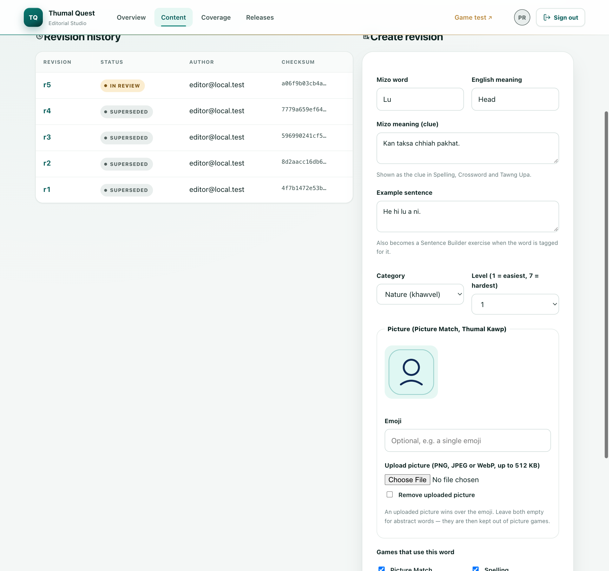
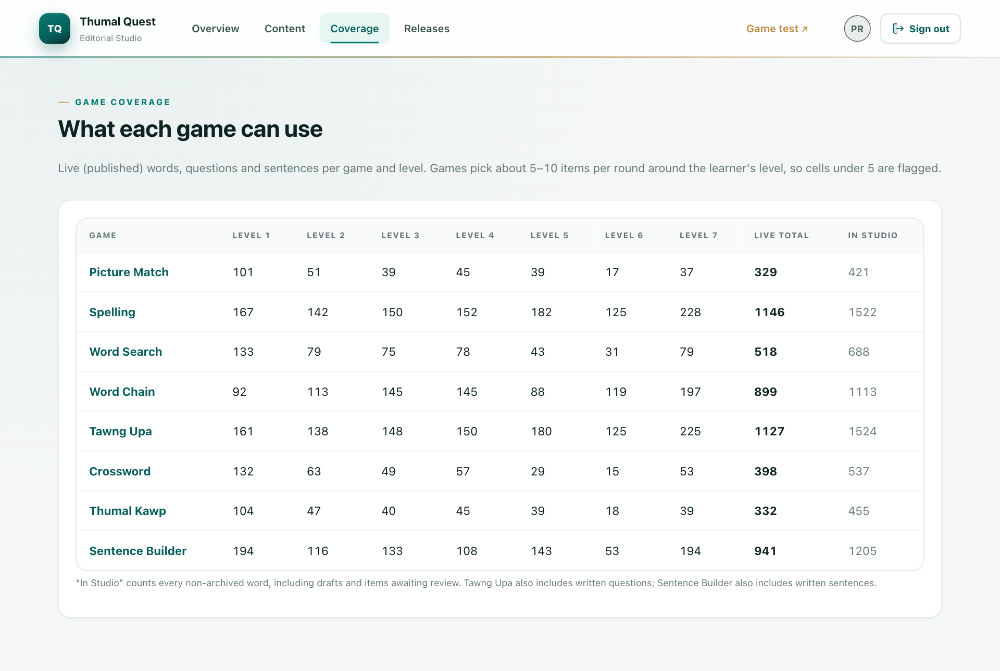

# Thumal Quest

**Khelh la, zir la, thiam rawh.** — *Play, learn, master.*

Thumal Quest is a game-first app for learning the **Mizo language** (lus), for
learners from age 5 to adults. It works offline on phones, and every word,
question and picture is written and reviewed by people in a web-based
**Editorial Studio**.

<p align="center">
  
  
  
  
</p>

## Features

- **8 games** — Picture Match, Spelling, Word Search, Word Chain, Tawng Upa
  (meaning quiz), Crossword, Thumal Kawp (memory cards) and Sentence Builder.
- **Adaptive difficulty** — each game has its own level (1–7) that rises and
  falls with the learner, aiming for about 78% correct answers.
- **1,600+ Mizo words** with original meanings, example sentences and pictures.
- **Offline first** — content packs are verified by SHA-256 and cached on the
  device; progress stays on the device.
- **Editorial Studio** (Rails) — edit words, pictures, questions and all game
  text with simple forms; independent review before anything is published.
- Phone-first design that also adapts to tablets and desktop browsers.

<p align="center">
  
  
</p>

## Quick start (macOS)

You need **Flutter 3.x**, **Ruby 3.3+** with Bundler, and **PostgreSQL 16**
(`brew install postgresql@16 && brew services start postgresql@16`).

```bash
git clone https://github.com/thadomaloma/thumal-quest.git
cd thumal-quest/backend

# 1. First time only: gems, database and an admin account
bundle install
EDITORIAL_ADMIN_EMAIL=you@example.org EDITORIAL_ADMIN_PASSWORD='choose-a-strong-password' \
  bin/rails db:prepare db:seed

# 2. Optional: load the Mizo word lists and game text as drafts for review
EMAIL=editor@example.org PASSWORD='another-strong-password' ROLE=editor bin/rails editorial:upsert_user
IMPORT_EDITOR_EMAIL=editor@example.org bin/rails editorial:import_pilot_content editorial:import_game_content
cd ..

# 3. Run the Editorial Studio and the app together
./run_local.command
```

Imported content waits for review. Until a reviewed pack is published (see
*Editing content*), the app plays with its built-in starter words.

Then open:

| What | URL |
|---|---|
| App (web preview) | http://localhost:5050 |
| Editorial Studio | http://localhost:3000 |

Press **Ctrl + C** to stop both. To run the app on a phone or simulator
instead, use `flutter run` (add
`--dart-define=THUMAL_QUEST_API_BASE_URL=http://<your-computer>:3000` to sync
content from your Studio).

## Editing content

1. Sign in to the Studio and open **Content → New content item**.
2. Pick **Word**, **Tawng Upa question**, **Game text** or **Sentence** and fill
   in the form. Words can have an emoji or an uploaded picture.
3. **Submit for review** — a different person (language reviewer) approves it.
4. A publisher creates a **content pack** under **Releases**; the app picks it
   up on its next sync.

**Coverage** shows how many words each game has at every level. See
[`backend/README.md`](backend/README.md) for roles and details.

## Tests

```bash
flutter analyze && flutter test          # app
cd backend && bin/rails test             # Editorial Studio
```

## Project structure

```text
lib/        Flutter app (screens, games, adaptive engine, content sync)
backend/    Rails 8 Editorial Studio and public content API
content/    Word lists, game text and questions (CSV/JSON sources)
assets/     Branding, fonts and bundled illustrations
docs/       Design system, runbooks and project history
scripts/    Release and validation checks
```

## Credits

- Vocabulary selection is cross-referenced with the Mizoram SCERT *Kumtluang*
  and *Vartian* primers; all definitions and example sentences are original
  (see `content/pilot/kumtluang/README.md`).
- Font: [Plus Jakarta Sans](https://github.com/tokotype/PlusJakartaSans) (SIL OFL 1.1).
- Icons: game-icons.net (CC BY 3.0), Tabler (MIT) and Material Design Icons
  (Apache 2.0) — see `assets/illustrations/ATTRIBUTION.md`.

## License

[MIT](LICENSE) © 2026 Maloma Thado. Third-party fonts and icons keep their own
licences (listed above).

Development history and earlier phase notes: [`docs/PROJECT_HISTORY.md`](docs/PROJECT_HISTORY.md).
