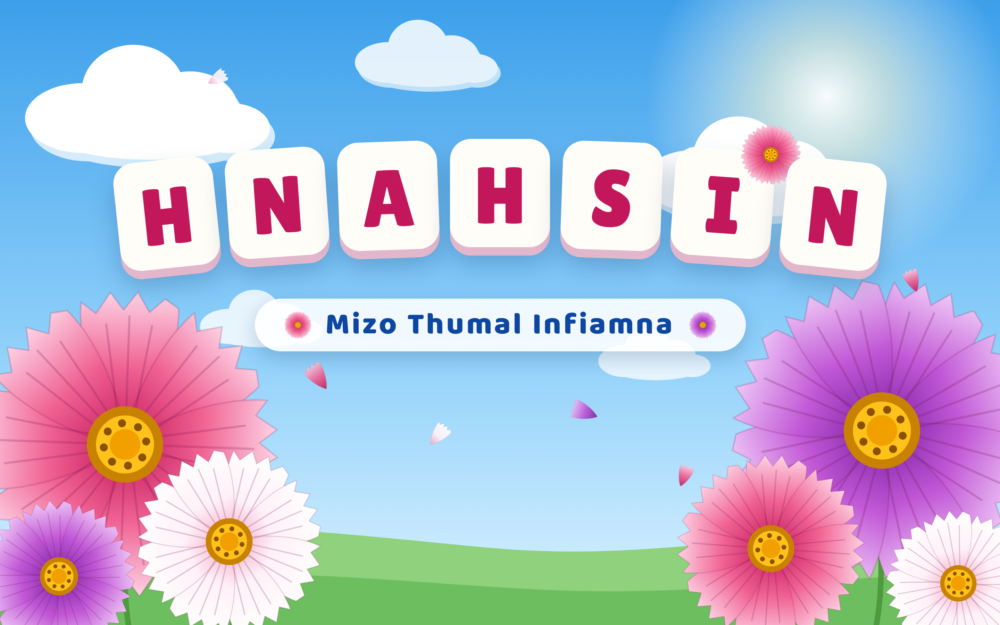

<p align="center"></p>

# Hnahsin

**Khelh la, zir la, thiam rawh.** — *Play, learn, master.*

Hnahsin (*Mizo Thumal Infiamna*) is a game-first app for learning the **Mizo language** (lus), for
learners from age 5 to adults. It works offline on phones, and every word,
question and picture is written and reviewed by people in a **Google Sheet**.

<p align="center">
  
  
  
  
</p>

## Features

- **8 games** — Picture Match, Spelling, Word Search, Word Chain, Tawng Upa
  (meaning quiz), Crossword, Thumal Kawp (memory cards) and Sentence Builder.
- **Adaptive difficulty** — each game has its own level (1–7) that rises and
  falls with the learner, aiming for about 78% correct answers.
- **1,600+ Mizo words** with original meanings, example sentences and pictures.
- **Offline first** — content packs are verified by SHA-256 and cached on the
  device; progress stays on the device.
- **Content Sheet** — words, pictures, questions and all game text are edited
  in a Google Sheet; its **Hnahsin → 🚀 Publish to the app** menu checks
  every row and publishes the content pack. No server to run.
- Phone-first design that also adapts to tablets and desktop browsers.

## Quick start (macOS)

You need **Flutter 3.x**.

```bash
git clone https://github.com/thadomaloma/hnahsin.git
cd hnahsin
./run_mac.command            # checks the Mac, runs analyze + tests, opens the app
```

Without a content URL the app plays with its built-in starter words. To use
the published content, pass the content pack's location:

```bash
flutter run --dart-define=HNAHSIN_API_BASE_URL=https://thadomaloma.github.io/hnahsin-content
```

Release builds for the App Store and Play Store need the same `--dart-define`;
`scripts/build_release.sh` passes it for you:

```bash
scripts/build_release.sh          # App Store .ipa and Play Store .aab
scripts/build_release.sh ios      # App Store only
scripts/build_release.sh android  # Play Store only
```

The old name, `THUMAL_QUEST_API_BASE_URL`, still works.

## Editing content

Content lives in the **Hnahsin content** Google Sheet (tabs Words, Questions,
Sentences, Game text, App text; the how-to is on its Help tab):

1. Add or change rows. Only rows whose **Status** is *Live* reach the app.
2. **Hnahsin → ✅ Check for problems** lists anything wrong, with links to the rows.
3. **Hnahsin → 🚀 Publish to the app** publishes the pack to
   [hnahsin-content](https://github.com/thadomaloma/hnahsin-content) on GitHub
   Pages; apps pick it up on their next sync, without an app update.

Setup and the sheet's script: [`content_studio/README.md`](content_studio/README.md).
The pack format is [`docs/API_CONTENT_PACK_V1.md`](docs/API_CONTENT_PACK_V1.md).

## Tests

```bash
flutter analyze && flutter test          # app
node --test content_studio/test          # content Sheet's pack builder
```

## Project structure

```text
lib/            Flutter app (screens, games, adaptive engine, content sync)
content_studio/ Apps Script for the content Google Sheet (check + publish)
content/        Source word lists from the Kumtluang and Vartian primers
assets/         Branding, fonts and bundled illustrations
design/         Hnahsin logo and icon source art
docs/           Design system, product notes and project history
scripts/        Mac diagnostics
```

## Credits

- Vocabulary selection is cross-referenced with the Mizoram SCERT *Kumtluang*
  and *Vartian* primers; all definitions and example sentences are original
  (see `content/pilot/kumtluang/README.md`).
- Font: [Plus Jakarta Sans](https://github.com/tokotype/PlusJakartaSans) (SIL OFL 1.1).
- Icons: game-icons.net (CC BY 3.0), Tabler (MIT) and Material Design Icons
  (Apache 2.0) — see `assets/illustrations/ATTRIBUTION.md`.

## License

[MIT](LICENSE) © 2026 Maloma Thado. Third-party fonts and icons keep their own
licences (listed above).

Development history and earlier phase notes: [`docs/PROJECT_HISTORY.md`](docs/PROJECT_HISTORY.md).
