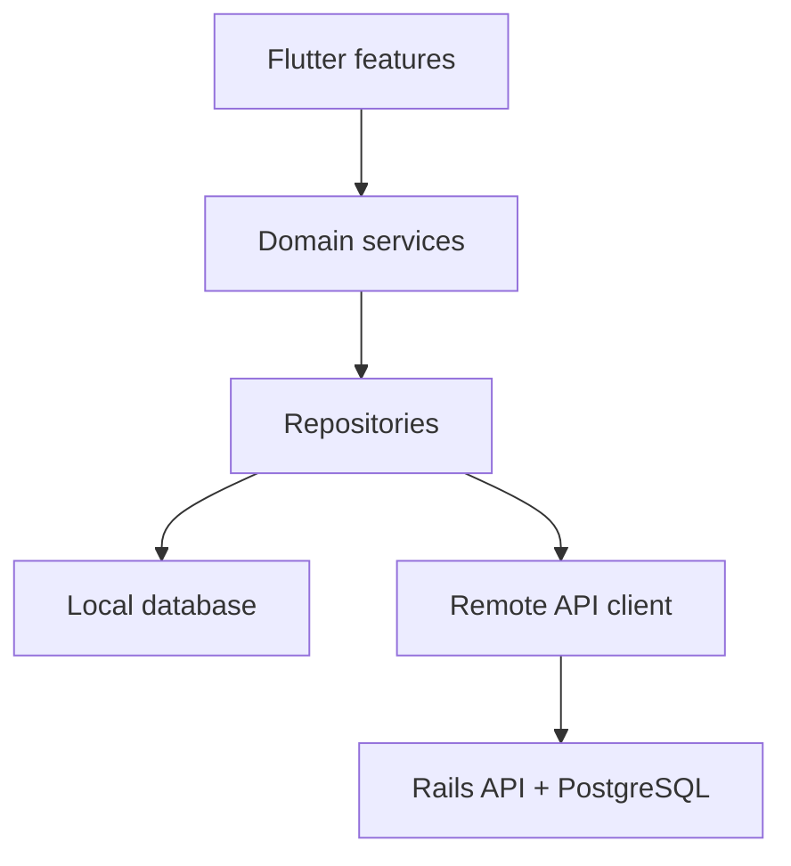

# ADR-001 — Thumal Quest Production Architecture

**Status:** Product boundary accepted; engineering implementation review pending  
**Date:** 13 September 2026  
**Decision owners:** Product owner + Flutter engineer  
**Review before:** Phase 1 implementation

## Context

Version 0.3 is a working Flutter prototype with six games, one
`QuestController`, SharedPreferences progress and content constants in
`data.dart`. It is intentionally small, but this structure cannot safely scale
to thousands of versioned items, adaptive review, resumable sessions, content
packs, optional sync and an editorial backend.

### Audit findings

| Area | Current state | Production risk |
|---|---|---|
| UI | Premium reusable widgets and four-tab shell | Business/game logic still inside widgets |
| Games | Six playable stateful screens | Repeated lifecycle; random rounds not reproducible |
| Progress | One controller + SharedPreferences | No transactions, migrations, learner/item history |
| Content | Dart constants, 30 word entries | No source/revision/rights/approval enforcement |
| Review | Two prototype enum states | `reviewRequired` is metadata only, not release gate |
| Offline | Everything bundled locally | No versioned update, checksum or rollback |
| Navigation | Direct Material routes | No deep-link/onboarding/session restore contract |
| Tests | Domain unit + basic widget tests | No persistence, game contract, integration/build tests |
| Platforms | Generated on first local run | Mac setup depends on Flutter/Xcode/PATH state |

## Decision

Use a **feature-first Flutter architecture** with clear UI, domain and data
boundaries; local database as learner-runtime source of truth; versioned content
packs; and a Rails API/Editorial Studio only when remote publishing/sync becomes
necessary.

Flutter remains the game/application engine. Rails is not required to play core
games and is not on the offline critical path.

## Target topology



Repositories present one interface to domain/UI and coordinate local/remote
sources. The client reads active content and progress locally first.

## Project structure target

```text
lib/
  app/
    app.dart
    router.dart
    theme/
  core/
    accessibility/
    analytics/
    errors/
    result/
    time/
  features/
    onboarding/
      data/
      domain/
      presentation/
    learning/
      data/
      domain/
      presentation/
    games/
      engine/
      picture_match/
      spelling/
      word_chain/
      word_search/
      tawng_upa/
      crossword/
    profile/
    guardian/
  data/
    local/
    remote/
    content_packs/
  shared/
    widgets/
```

Phase 1 migration is incremental. Existing screens remain functional while one
game at a time moves behind the new contracts.

## Layer contracts

### Presentation

- Renders immutable UI state
- Sends user intent as commands/actions
- Owns animation, responsive layout and route presentation
- Does not calculate score/mastery, query storage or choose content eligibility

### Domain

- Pure Dart where possible
- Game session state machine, scoring, attempt result and resume snapshot
- Lesson assembly, mastery and spaced-review scheduling
- Content eligibility policy
- Uses injected clock/random seed to make tests deterministic

### Data

- Repository is source of truth for each data family
- Local service owns database transaction/migration
- Remote service only maps transport objects
- Content pack activation is atomic and reversible
- Sync policy is explicit; no hidden last-write-wins for child data

## State management decision

Phase 1 should begin with Flutter SDK primitives plus repository/view-model
contracts. A third-party state package can be selected only after a small
prototype compares:

- Testability and code generation overhead
- Async cancellation/error handling
- Team familiarity
- Long-term maintenance and package health

Current `ChangeNotifier` can remain at shell boundary during migration. This ADR
does not prematurely require Riverpod, Bloc or another package.

## Local persistence decision

SharedPreferences remains suitable only for tiny non-critical settings.
Production progress/content requires a transactional local database.

### Evaluation candidates

- SQLite via Drift
- SQLite via another maintained Flutter adapter

### Benchmark criteria

- iOS/Android/macOS support
- Schema migrations and transactions
- Typed queries/test database
- Batch import for 3,000+ items and audio metadata
- Isolate/startup behavior
- Package maintenance/security

Phase 1 ADR-002 below records the selected package/version.

### ADR-002 — SQLite adapter selection

**Date:** 13 September 2026  
**Status:** Implemented; Mac/CI resolution pending  
**Decision:** Use `sqflite` 2.4.x with `path` 1.9.x for transactional progress,
reward-ledger and game-session storage on Android, iOS and macOS. Retain
`SharedPreferencesAsync` only as a web/development fallback and legacy-progress
migration source.

This choice keeps Phase 1 migration small, supports explicit transactions and
schema migrations, and avoids generated database code while the domain model is
still changing. Re-evaluate typed query generation when content/mastery tables
expand in Phase 2. Package resolution, analyze, tests and native builds must run
on the Mac/CI before this ADR is marked verified.

## Core domain records

- `LearnerProfile`
- `LearnerPreferences`
- `ContentItem` + `ContentRevision`
- `ContentPack` + `PackActivation`
- `LessonPlan` + `LessonItem`
- `GameDefinition`
- `GameSessionSnapshot`
- `AttemptRecord`
- `MasteryRecord`
- `ReviewSchedule`
- `RewardLedger`

XP and rewards use an append-only ledger or deduplicated event ID so a resumed
or retried completion cannot award twice.

## Offline-first rules

1. Bundled starter pack is always available.
2. Active content pack is read locally.
3. Learner attempts and mastery write locally in one transaction.
4. Remote sync is optional and never blocks play.
5. Downloaded pack is verified before activation.
6. Previous pack remains rollback candidate.
7. Deleting an account does not silently delete local guest data without clear
   choice.

## Content safety enforcement

- Debug/editor builds may load draft fixtures with visible watermark.
- Release learner builds load only approved/published items.
- Eligibility is enforced in repository/domain, not each screen.
- Content pack validation checks approval, rights and referenced assets.
- Server cannot mark content approved without required review records.
- Current V0.3 `prototypeChecked` maps to V2 `draft`, never `approved`.

## Backend boundary

Rails API arrives in Phase 4, after local learning engine is proven. It owns:

- Editorial roles, review workflow, revision and audit history
- Content/audio publication and rollback
- Optional authenticated progress sync
- Guardian/family/classroom codes
- Feature configuration and support tools
- Export/delete requests

Flutter never contains cloud service-account credentials. Google Translation
drafts, if enabled, are requested by the backend and quarantined in editorial
workflow.

### ADR-003 — Phase 4A Editorial Studio foundation

**Status:** Accepted for implementation, runtime gate pending  
**Decision date:** 13 September 2026

Use a Rails 8.1 full-stack server with PostgreSQL for the internal Editorial
Studio and a separate read-only `/api/v1` content-pack surface. Content uses
stable item IDs, immutable revision rows, canonical SHA-256 checksums and
role-separated review decisions. Published packs are immutable full snapshots;
a rollback creates a new version pointing to the exact previously reviewed
revisions.

The backend does not become a Flutter runtime dependency. Downloaded packs are
staged, schema/checksum validated and atomically activated; the app retains its
last valid local pack whenever the service is unavailable.

## API style

- JSON over HTTPS for editorial/content/sync operations
- Stable resource IDs and explicit schema/API version
- Idempotency key for progress upload/reward-sensitive mutations
- Cursor pagination for editorial lists
- ETag/version conflict for editor writes
- Short-lived signed asset upload/download URLs
- Client handles offline/timeouts without losing current local state

## Security and privacy

- Guest-first, minimum data
- Secrets in CI/server secret store, never source/client
- TLS; encrypted platform storage for tokens
- Role-based admin access + audit events
- Rate limit and abuse protection
- Dependency inventory and release scan
- No precise location/contact access
- Analytics events use random local/authorized pseudonymous identifier only

## Navigation

Adopt declarative route names/typed arguments during Phase 1. Required routes:

- `/welcome`
- `/onboarding/age`, `/level`, `/goal`, `/placement`
- `/home`, `/learn`, `/games`, `/profile`
- `/lesson/:lessonId`
- `/game/:gameId`
- `/review`
- `/guardian`

Session route must restore from snapshot or fail safely to result/home.

## Error model

Domain/data APIs return typed outcomes rather than throwing raw platform errors
through UI:

- recoverable offline
- content unavailable/corrupt
- storage full/migration failure
- permission denied
- session invalid/expired
- remote auth/sync conflict

User copy is helpful and does not expose stack traces/secrets. Diagnostic log is
available for support with consent.

## Testing strategy

| Layer | Required tests |
|---|---|
| Domain | Scoring, lifecycle, mastery, scheduler, eligibility |
| Data | DB migrations, repository local/remote, pack rollback |
| Presentation | Onboarding, accessibility semantics, answer/result states |
| Integration | First run, offline lesson, resume, content update |
| Build | Analyze/test + Android/iOS/macOS smoke where runners permit |

Random and time-dependent behavior uses injected `RandomSource` and `Clock`.

## Observability

- Privacy-reviewed product events
- Crash/error reports with content/app version, not learner free text
- Pack download/activation health
- Local debug log export behind guardian/adult action
- No third-party analytics SDK added until child-data review passes

## Consequences

### Benefits

- Learning and game rules testable without widgets
- Offline reliability and content safety centralized
- Flutter client remains usable without backend
- Rails strength is used for editorial/admin workflow
- Feature teams/content editors can evolve independently

### Costs

- More types and migrations than current prototype
- Temporary adapters during Phase 1 refactor
- Local/remote model mapping work
- Requires explicit content release operations

## Rejected alternatives

- **Rails webview as mobile game:** Weaker native interaction/offline/game feel.
- **Backend-required play:** Poor fit for unreliable network and child privacy.
- **SharedPreferences for all progress:** No robust query/migration/transaction.
- **Direct Google translation in client:** Credential, quality and governance
  risk.
- **Full rewrite before tests:** High regression risk; incremental migration is
  safer.

## ADR-004 — Verified media delivery and atomic offline activation

**Status:** Accepted, 13 September 2026

Audio bytes live in private S3-compatible storage and bypass Rails during upload through short-lived signed PUTs. Rails remains the authority for metadata, independent review, immutable manifests and rollback. Flutter accepts only `lus` schema 1.0 packs, verifies canonical manifest SHA-256 plus every audio byte count/MIME/checksum, then atomically changes a local active pointer. A candidate failure never replaces the last verified pack. Remote word records are adapted through one controller catalog; bundled reviewed content remains the fallback.

## Approval checklist

- [x] Product owner approves offline-first and backend timing — 13 Sep 2026
- [ ] Engineer approves target boundaries and migration path
- [ ] Language lead approves content eligibility enforcement
- [ ] Privacy reviewer approves account/analytics approach
- [ ] ADR-002 local database benchmark scheduled
