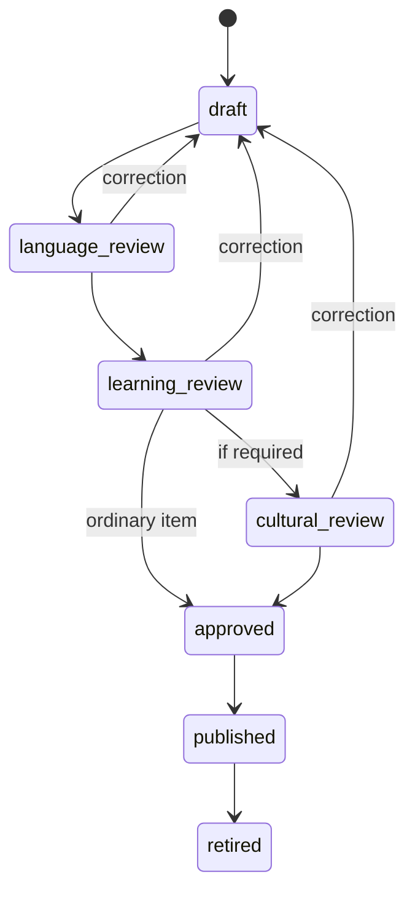

# Hnahsin — Mizo Content Editorial Guide

**Version:** 0.1 / Phase 0 draft  
**Approval required from:** Mizo language lead + educator  
**Applies to:** Word, sentence, clue, explanation, story, audio and cultural item

## 1. Purpose

He guide hian app-a Mizo tawng content dik, natural, age-appropriate leh source
chiang a nih dân a ruat. Machine translation, AI emaw contributor submit chu
draft a ni vek; approval gate kal tlang hnuah chauh public content a ni.

## 2. Editorial authority

### Required roles

- **Language reviewer:** Spelling, grammar, meaning and natural usage
- **Learning reviewer:** Age, level, prompt clarity and distractor quality
- **Cultural reviewer:** Older word, custom, history, proverb and sensitive item
- **Audio reviewer:** Pronunciation, clarity, pacing and metadata
- **Publisher:** Required approvals complete tih verify a release pack siam

Mi pakhatin role pahnih a keng thei; item publish approval erawh mi pahnih talin
an pe tûr. Draft author mahni chauh final approver a ni lo ang.

## 3. Editorial principles

1. **Natural first:** Dictionary-like direct translation aiin context-a Mizo
   natural hman dân dah.
2. **One sense at a time:** “In” (house) leh “in” (drink) ang polysemy chu ID leh
   sense hrang neihtîr.
3. **Display spelling preserved:** Search normalization-in display text a thlak
   lo ang.
4. **Variant respected:** Regional/spoken form chu “wrong” tia mark ngawt lovin
   canonical/variant/context sawi fiah.
5. **Age fit:** Child prompt tawi leh concrete; adult content childish lo.
6. **No invented authority:** Source hriat loh, uncertain meaning emaw AI
   suggestion chu `draft` status-ah chauh.
7. **Correction visible:** Published error chu history bo lovin new revision
   hmanga siamṭhat.

## 4. Launch language baseline

- Contemporary Standard Mizo written form is the default canonical register.
- Mizo Unicode characters and diacritics chu an nih dân angin vawn.
- English chu support gloss/interface atan; Mizo definition substitute ni lo.
- Regional, generational or borrowed word chu metadata-ah mark.
- Formal/informal, respectful/casual usage distinction awm chuan note.

Baseline hming leh exact orthography rules hi Language Council-in Phase 0 gate-ah
sign-off tûr.

## 5. Content types

| Type | Required core fields | Extra review |
|---|---|---|
| Word | form, sense, POS, Mizo definition, level | Variant/polysemy where needed |
| Sentence | Mizo text, learning purpose, linked senses | Naturalness and age fit |
| Multiple choice | prompt, answer, distractors, explanation | No ambiguous answer |
| Spelling | target, prompt/hint, accepted forms | Grapheme/unit correctness |
| Audio | linked text, speaker, consent, variant | Pronunciation + noise QA |
| Story | title, text/scenes, objectives | Culture, safety, copyright |
| Tawng upa/thufing | text, meaning, context, source | Cultural reviewer mandatory |
| Image | description, license, alt text | Cultural accuracy |

## 6. Writing style

### Mizo learner text

- Sentence tawi, active and context-clear hman.
- Beginner prompt-ah unfamiliar Mizo word tam tak dah lo.
- Instruction pattern consistent: `… thlang rawh`, `… ziak rawh`, `… ngaithla
  rawh`.
- Feedback-in chhanna dik bâkah reason/context pe.
- “A dik lo” chauh hmang lovin next learning cue pe.
- Age 5–7 tân sentence pakhat instruction; audio cue tel.

### English support text

- Natural international English, sentence tawi.
- Literal translation avânga awkward copy pumpelh.
- English gloss chu sense-specific ni se.
- Navigation/action label: Home, Learn, Games, Profile, Continue, Try Again,
  Listen, Hint, Settings.

### Punctuation and text safety

- Curly quote optional; project-wide consistent ni se.
- Ellipsis chu `…` hmang; three dots leh single ellipsis inpawlh lo.
- Word search/crossword letter conversion rule documented per game.
- Emoji chu meaning source ber ni lo; alt/semantic text nei.
- Uppercase conversion hian Mizo display characters a tihchhiat loh test.

## 7. Meaning and example rules

Word item tin:

- Sense pakhat chauh focus
- Part of speech correct
- Mizo definition-in target word ringawt repeat lo
- English gloss 1–4 words where possible
- Example sentence natural, age-safe and self-contained
- Example-ah target form hman
- Misleading stereotype, political advocacy or religious assumption pumpelh;
  context-specific pack-ah clear taka label

## 8. Distractor rules

Multiple-choice distractor chu:

- Category/length/grammar-ah plausible enough to teach discrimination
- Correct answer nên synonym ambiguous ni lo
- Nonsense/insult/unsafe content ni lo
- English/Mizo language mismatch avânga answer obvious lutuk ni lo
- Same distractor repeated excessively ni lo
- Common learner error a nih chuan `error_tag` record

Question pakhat chu qualified reviewer pahnihin chhanna pakhat chauh a neih tih
an confirm tûr.

## 9. Difficulty and age tags

| Level | Definition | Typical content |
|---|---|---|
| TQ0 | First recognition | Picture, one common word, audio |
| TQ1 | Home Mizo | Common phrase, simple sentence |
| TQ2 | Growing reader | Spelling, short story, sentence pattern |
| TQ3 | Confident user | Nuance, longer reading, idiom |
| TQ4 | Culture & mastery | Older/literary/cultural depth |

Age floor chu reading load/content safety a entîr; intelligence level a entîr
lo. Adult beginner-in TQ0/TQ1 content a hmang thei a, visual presentation chu
adult-appropriate variant a nei tûr.

## 10. Variant policy

- `canonical_form`: Launch standard display form
- `accepted_variants`: Correct alternative forms
- `search_aliases`: Typing/search convenience; correct claim ni lo
- `register`: child/common/formal/literary/older/colloquial
- `region_notes`: Reviewer-approved only
- `do_not_accept`: Common incorrect form, reason note nên

Game scoring-in accepted variant a hnawl lo tûr. Teaching screen-ah canonical
form chu chiang taka lan, variant context hrilhfiah.

## 11. Audio standard

### Recording

- Quiet room, same microphone distance, clipping/noise awm lo
- WAV master preferred; compressed delivery copy separate
- One word clip and one sentence clip separate
- Natural pace + optional slow learning take
- Speaker forced exaggeration pumpelh

### Metadata and consent

- Speaker ID/pseudonym, age band (not exact DOB), variant/register
- Recording date, device/microphone and editor
- Written consent/license scope; child speaker requires guardian consent
- Text revision linked; text change chuan audio re-review
- Withdrawal/contact process documented

### QA

- Audio reviewer listens without script first
- Language reviewer compares script/pronunciation
- Loudness/noise technical check
- Filename is opaque ID; no speaker personal data in filename

## 12. Machine and Google Cloud policy

- Google Cloud Translation Mizo code `lus` output = **draft gloss suggestion**
- AI-generated Mizo = `draft`, with generator/model/date recorded if retained
- No automatic publish
- No machine output used as pronunciation authority
- API key/service credential mobile client-ah awm lo
- Reviewer sees source text and machine provenance
- Sensitive child/user text external service-a thawn hmaa privacy approval ngai

## 13. Review states

| State | App release eligible? | Meaning |
|---|:---:|---|
| draft | No | Author/AI candidate, untrusted |
| language_review | No | Language reviewer working |
| learning_review | No | Language passed; pedagogy pending |
| cultural_review | No | Special cultural approval pending |
| approved | Yes | All required sign-offs complete |
| published | Yes | Included in signed release pack |
| rejected | No | Unsuitable; reason retained |
| retired | No new sessions | Formerly published; replaced/withdrawn |

## 14. Approval checklist

Reviewer tin hian yes/no/note pe tûr:

- Spelling and Unicode correct
- Meaning is accurate for selected sense
- Sentence is natural and uses target correctly
- Level and age tags fit
- Distractors are unambiguous
- Variant/register note is fair
- Cultural statement is supported
- Rights/source metadata complete
- Audio matches approved text
- No privacy/safety issue

`approved` tûr chuan required answer zawng zawng Yes; note unresolved awm lo.

## 15. Correction workflow and SLA

1. User report receives tracking ID
2. Published item can be temporarily disabled without app update
3. Language lead triages severity
4. Revision goes through affected review stages
5. New content pack is published and old revision retained
6. Reporter/community is informed where practical

Target after public launch:

- Critical harmful/misleading: disable within 24 hours
- Clear spelling/audio error: decision within 3 working days
- Nuanced dispute/variant: Council review within 14 days

## 16. Phase 0 sign-off

Before this guide becomes version 1.0, Language Council must decide:

- Canonical standard naming
- Required reviewer qualification
- Diacritic/orthography reference source
- Variant dispute resolution
- Tawng upa/proverb sourcing policy
- Audio compensation and withdrawal terms

