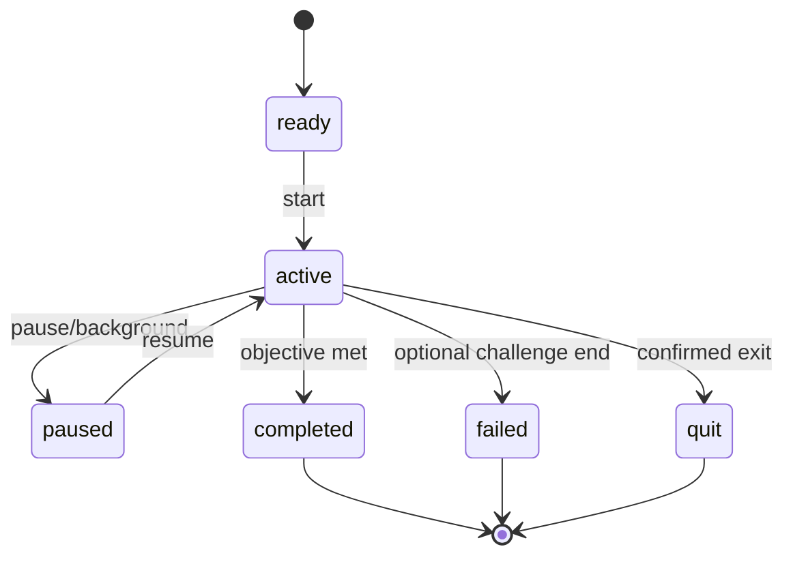

# Hnahsin — Game Session Engine V2 Specification

**Status:** Phase 1B implementation; device verification pending  
**Goal:** Game tin professional, testable, resumable leh learning-aware siam

## 1. Why V2

Current `GameSession` hian hearts, score, combo, accuracy, stars leh XP a pe a,
prototype atan a tawk. V2 hian game paruk leh future game-te lifecycle, content
eligibility, attempts, hints, accessibility, resume, mastery and rewards contract
thuhmun a pe ang.

## 2. Design principles

- Pure Dart engine; Flutter widget dependence awm lo
- Immutable snapshot/event-driven transition
- Seeded randomness for reproducible rounds
- One attempt rewarded once
- Wrong answer teaches; hearts/timer do not block core path
- Content revision recorded with every attempt
- Pause/restore safe
- Learning result and entertainment score are separate
- No unapproved item in release session

## 3. Session state machine

`failed` cannot erase learning attempts. Relaxed/core lesson mode should normally
complete even after mistakes; “hearts exhausted” becomes a coaching checkpoint
rather than forced lockout.

## 4. Core contracts

### GameDefinition

- `gameId`, `version`
- supported skills and TQ levels
- age floor/ceiling
- round size range
- modes: relaxed, standard, timed, daily
- accessibility capabilities
- content query/eligibility rules
- scoring policy ID
- completion policy ID

### SessionConfig

- learner ID/local profile ID
- game definition/version
- lesson/review source
- mode and difficulty
- random seed
- selected content IDs + revisions
- locale/support language
- sound/haptic/reduced-motion preferences
- created/start/expiry timestamps via injected clock

### SessionSnapshot

- stable `sessionId`
- state and schema version
- current item/index
- score, combo, hearts/coaching tokens
- attempts and hint state
- elapsed active time (not wall-clock alone)
- random seed and remaining content order
- reward transaction ID, nullable
- saved timestamp

### AttemptEvent

- attempt ID, session ID
- content item ID + revision
- prompt/response type
- normalized correctness
- accepted variant used
- hint count/type
- response duration bucket
- skill evidence
- occurred-at local instant and timezone offset
- no unnecessary free-form child text in analytics export

### SessionResult

- terminal state/reason
- entertainment score, stars, combo
- learning evidence per item/skill
- attempted/correct/hint-assisted counts
- XP/reward proposal with idempotency key
- next recommended action
- items due for later review

## 5. Command and event model

Commands:

- `createSession(config)`
- `start()`
- `submitAnswer(answer)`
- `requestHint(type)`
- `skip()` where policy permits
- `pause(reason)`
- `resume()`
- `quit(confirmed)`
- `finish()`

Events:

- `SessionCreated`, `SessionStarted`
- `ItemPresented`
- `HintUsed`
- `AnswerAccepted`, `AnswerRejected`
- `FeedbackPresented`
- `ItemAdvanced`
- `SessionPaused`, `SessionResumed`
- `SessionCompleted`, `SessionFailed`, `SessionQuit`
- `RewardCommitted`

Invalid transition returns typed failure and leaves state unchanged.

## 6. Round generation

Round generator accepts:

- eligible approved content
- target skills/level/category
- recent exposure and mastery
- learner common errors
- desired new/review mix
- deterministic random seed

Rules:

- No duplicate sense unless repetition is intentional
- Distractors are pre-reviewed or policy-valid
- Required asset availability checked
- Avoid showing the same item in same surface repeatedly
- Prefer due review, then weak skills, then controlled new items
- Record exact content IDs/revisions to reproduce support issue

## 7. Scoring

### Separate outputs

- **Learning evidence:** correctness, recall delay, hint use, confidence/context
- **Game score:** feedback/reward for fun
- **XP:** effort/progression reward, capped and idempotent

Default standard scoring proposal:

- Correct first attempt: 100
- Combo bonus: +25 per consecutive correct, capped at +100
- Hint-assisted correct: 60; combo does not increase
- Retry correct: 50
- Incorrect: 0; supportive feedback
- Speed bonus only in explicitly timed challenge, not learning evidence

XP is computed after completion from completed items and learning effort, not
raw taps. Quit/resume cannot duplicate XP.

## 8. Hearts and failure

- Ages 5–7/core path: no visible hearts; coaching progress instead
- Ages 8+ relaxed: mistakes do not end learning
- Standard challenge: three hearts permitted
- Hearts exhausted shows review/coaching screen and lets learner retry later
- No purchase/ad required to refill
- Result copy avoids shame

## 9. Feedback contract

Every answer produces:

- correct/incorrect/accepted-variant state
- canonical answer
- short Mizo explanation appropriate to learner level
- optional English support
- audio replay when available
- misconception tag where useful
- next action

The UI cannot reveal the correct answer through colour alone.

## 10. Resume and idempotency

- Save snapshot after answer/hint/item advance and on app lifecycle background
- Snapshot schema versioned and migratable
- Resume verifies content revisions/assets still available
- Incompatible snapshot offers safe restart; attempts already saved remain
- Reward commit uses `rewardTransactionId`; repository rejects duplicate
- Completed session cannot accept more answers

## 11. Mastery handoff

Engine emits evidence; `MasteryService` decides schedule. Suggested initial
weights:

| Evidence | Strength |
|---|---:|
| Correct after ≥7 days, no hint | 1.0 |
| Correct after 1–6 days, no hint | 0.8 |
| Correct same session | 0.5 |
| Correct with hint/retry | 0.3 |
| Incorrect | lapse signal |

Weights are hypotheses requiring teacher/pilot validation. They are not hard
coded into each game.

## 12. Game adapters

Each game supplies only presentation-specific data and answer evaluator:

| Adapter | Response | Special rule |
|---|---|---|
| Picture Match | selected item ID | Image/audio asset fallback |
| Spelling | grapheme/tile sequence | Accepted variants and normalization |
| Word Search | selected grid path | Seeded grid + Mizo units |
| Word Chain | normalized word/sense ID | Unit boundary, duplicate, dictionary |
| Tawng Upa | choice ID | Cultural approval required |
| Crossword | cell entries | Normalization + per-clue evidence |
| Listen & Pick | selected item ID | Audio readiness mandatory |
| Sentence Builder | ordered token IDs | Multiple approved natural forms possible |

## 13. Accessibility hooks

- Engine has no timer assumption
- UI can announce prompt/progress/feedback semantics
- Reduced motion does not change state timing
- Alternate interaction possible for drag-based game
- Audio prompt has replay/transcript policy
- Input normalization supports Unicode and accepted forms

## 14. Analytics boundary

Allowed aggregate events:

- game/version/mode started and terminal state
- broad TQ/age band
- item ID/revision and correctness if privacy review permits
- hint/skip and duration bucket
- crash/content error reference

Do not export learner free-form spelling/voice recording by default. Raw voice
stays local unless explicit informed guardian/adult consent and feature policy.

## 15. Required tests

### State

- Only valid transitions occur
- Background/resume preserves state
- Submit after terminal is rejected
- Quit confirmation behavior

### Determinism

- Same definition/content/seed gives same order/grid
- Different seed remains within eligibility rules

### Scoring/reward

- First/hint/retry/combo scores
- Combo cap
- XP idempotency on duplicate result commit
- Zero attempt result

### Content

- Draft/rejected/retired excluded from release
- Missing asset fallback or exclusion
- Accepted variant scores correctly
- Content revision stored

### Accessibility

- Relaxed mode completes without timer/hearts failure
- Semantic feedback data includes non-colour status

## 16. Migration plan

1. Add V2 domain types and compatibility adapter for current result
2. Port Picture Match as reference implementation
3. Validate snapshot/persistence and widget tests
4. Port Spelling and Tawng Upa
5. Port Word Search, Word Chain and Crossword
6. Remove duplicated widget-local scoring/lifecycle
7. Turn on release content eligibility enforcement

Each port ships only when behavior parity tests and new contract tests pass.

## 17. Phase 1 acceptance

- All six games instantiate one engine contract
- Round can be reproduced from support ID/seed
- Force-close/resume loses no committed answer
- Reward cannot duplicate
- Draft content cannot enter release session
- Relaxed/core path has no punitive hard stop
- Domain tests run without Flutter widget binding

## 18. Implementation note — 13 September 2026

The pure-Dart V2 engine, seeded random source, versioned snapshots, relaxed,
standard and timed modes, repository session contract, and idempotent reward
transaction are implemented. All six existing games use one lifecycle runtime
through a temporary compatibility façade. Each adapter serializes its complete
presentation state; the shared runtime handles background pause, autosave,
restore, timer state and hint-assisted scoring. Flutter/native verification and
the eventual typed attempt-event stream remain open.
