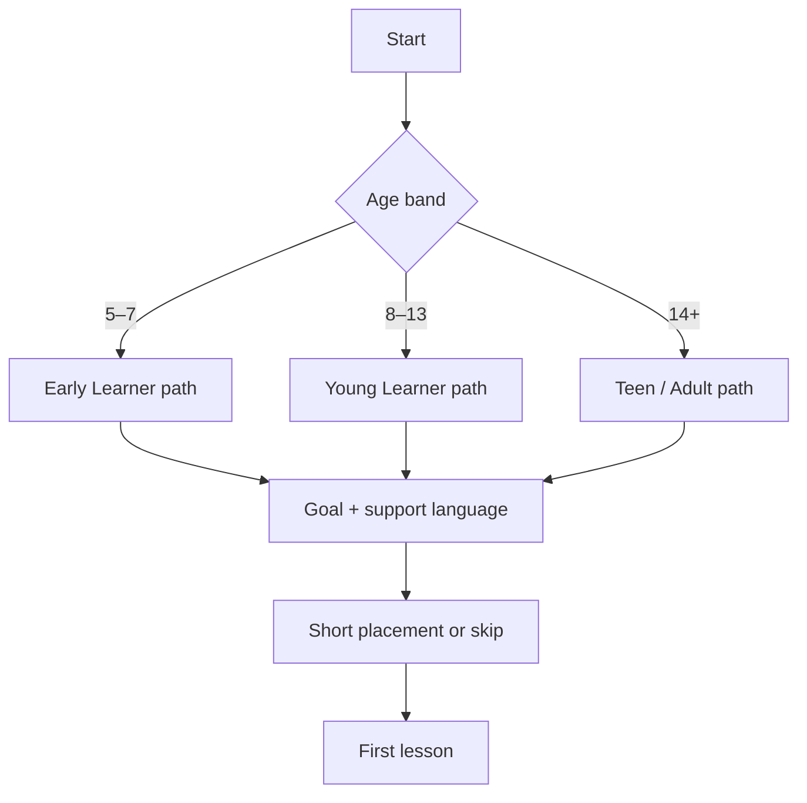

# Hnahsin — Learner Personas

**Version:** 0.1 / Phase 0 draft  
**Purpose:** Product, UX, content and learner-testing decision siam nân

Personas hi real user research substitute a ni lo. Phase 0 learner interview
leh usability test-a kan finfiah emaw kan siamṭha tûr hypothesis a ni.

## Priority matrix

| Persona | V1 priority | Main value | Biggest risk |
|---|---|---|---|
| Rini — 10, Mizoram | Primary | Reading/spelling through play | Too easy/worksheet-like |
| Mika — 11, Japan diaspora | Primary | English-supported home Mizo | Audio/copy feels unnatural |
| Lalruati — 29, adult heritage learner | Secondary | Flexible structured refresh | Childish visual/rewards |
| Tetea — 6, early learner | Supported | Picture/audio first words | Reading and motor load |
| Zirtîrtu Mawia — teacher/parent | Influencer | Trust, guidance, progress | Content error or opaque data |

---

## Persona 1 — Rini, Growing Reader

**Age:** 10  
**Location:** Mizoram  
**Mizo:** A sawi thei; chhiar/ziak leh spelling a la tihngheh mêk  
**Device:** Family Android phone; network a inang lo  
**Priority:** Primary

### Goal

- Sikul leh nî tin nun thumal spelling dik
- Story tawi chhiar thiam
- Game-a score leh collection hmanga progress hmuh

### Behaviour

- 5–8 minute session peih
- A challenge lutuk chuan quit; awlsam lutuk chuan tui lo
- Immediate feedback leh visual reward a duh
- Friend nên score compare a duh, mahse public profile a mamawh lo

### Product response

- TQ1/TQ2 placement
- Spelling, Word Search, Sentence Builder leh Story Quest
- Difficulty adaptive; timed mode optional
- Weekly collection trail and personal best
- Explanation tawi Mizo-in, audio replay

### Success signal

Kar 4 hnuah target thumal spelling leh story comprehension pre-test aiin a pung.

### Test questions

- Instruction chhiar lovin game tih dân a hre em?
- Wrong answer hnuah eng nge a zir tih a sawi thei em?
- Reward leh learning inkâr eng nge a ngaih pawimawh zâwk?

---

## Persona 2 — Mika, Diaspora Beginner

**Age:** 11  
**Location:** Japan  
**Mizo:** In lamah a ngaithla; chhânna English/Japanese-in a pe fo  
**Device:** iPhone/iPad; guardian-controlled account  
**Priority:** Primary

### Goal

- Pi leh pu/family nên Mizo basic conversation
- Thumal awmzia leh pronunciation hriat
- Mizo identity leh culture nên inpawh

### Behaviour

- English UI a mamawh
- Roman-script Mizo chhiar a thei mahse sound cluster a hriat lo
- Native audio slow replay a tangkai ber
- “Wrong” tih tam lutuk chuan zah leh khelh duh lo

### Product response

- English support copy + Mizo lesson content
- Listen & Pick, Picture Match, Conversation Path
- Slow/normal native audio; no fake confidence speech score
- Home/family situation story
- Encouraging correction and repeated context

### Success signal

Kar 4 chhûngin home conversation phrase 20+ context dikah a hman thei.

### Test questions

- English gloss chhiar lovin audio + picture aṭangin meaning a man em?
- Mizo text leh audio timing a rem em?
- Culture card hi identity connection a siam em, stereotype ang a lang em?

---

## Persona 3 — Lalruati, Adult Heritage Learner

**Age:** 29  
**Location:** Overseas  
**Mizo:** Basic conversation; formal reading, spelling leh tawng upa a harsat  
**Device:** Android/iPhone; commute-a hmang  
**Priority:** Secondary

### Goal

- Mizo chhiar leh ziak confidence neih
- Tawng upa, natural expression leh culture zir
- Nî tin 5–10 minute-a mahni pace-in zir

### Behaviour

- Childish animation/reward a duh lo
- Why/how explanation a duh
- Placement check leh skip-ahead a duh
- Progress statistic leh long-term mastery a ngaih pawimawh

### Product response

- TQ2/TQ3 placement and challenge mode
- Detailed explanation toggle
- Crossword, Tawng Upa, Story Quest, Culture Trail
- Mastery dashboard; cosmetic reward subtle
- Offline commute pack

### Success signal

Kar 6 hnuah reading passage leh natural sentence construction a improve.

### Test questions

- Visual chu adult tân premium a lang em?
- Explanation hi a tawi lutuk emaw schoolbook ang lutuk em?
- Session stop/resume chu commute use nên a rem em?

---

## Persona 4 — Tetea, Early Learner

**Age:** 6  
**Location:** Mizoram or diaspora family  
**Mizo:** Spoken exposure level danglam  
**Device:** Parent tablet/phone  
**Priority:** Supported foundation

### Goal

- Common Mizo thumal audio/picture nên hre hran
- Letter/sound pattern bul zir
- Parent nên khelh nuam

### Behaviour

- Long instruction chhiar thei lo
- Tap target lian leh voice cue a mamawh
- 2–4 minute hnuah attention a danglam
- Accidental exit/purchase tih theih

### Product response

- Picture/audio first, text tawi
- 52–64 dp target, limited choices, calm animation
- No timer/core typing requirement
- Guardian-gated links/settings
- Family Quest co-play

### Success signal

Session 3–5 hnuah target words picture/audio-a 80%+ hre hran, pressure tel lovin.

### Test questions

- Adult help lovin next action a hmu em?
- Audio replay a reach thei em?
- Feedback a hlauhawm/overstimulating em?

---

## Persona 5 — Zirtîrtu Mawia, Trust Holder

**Role:** Parent, Mizo teacher or community tutor  
**Mizo:** Fluent; learner progress enkawltu  
**Priority:** Influencer / approver

### Goal

- Content dik leh age-appropriate a nih hriat
- Learner-in eng nge a zir tih hmuh
- Error report awlsam leh correction response hmuh
- Offline/class setting-a hman

### Behaviour

- Point/XP aiin actual skill a ngaih pawimawh
- Machine translation leh ad/data tracking a ringhlel
- Lesson sequence leh source hriat a duh

### Product response

- Mastered items and skill report
- Review/provenance and correction route
- Plain-language privacy summary
- Family/class code future option
- Downloadable offline pack

### Success signal

Teacher/parent-in learner tân kar 4 hman a recommend leh content a rintlak.

---

## Onboarding decision tree

## Phase 0 research plan

### Minimum sample

- 3 learners ages 5–7 + guardians
- 5 learners ages 8–13, at least two diaspora
- 3 teens/adults, at least two heritage learners
- 3 teachers/parents/content reviewers

Total minimum: **14 participants**. This is usability discovery, not statistical
proof.

### Session

1. Guardian/adult consent and privacy explanation
2. Five-minute context interview
3. Unassisted onboarding task
4. One recommended lesson and one self-chosen game
5. Recall check after 10 minutes or next session
6. Short feedback; no unnecessary child recording/storage

### Pass thresholds

- ≥80% reach first lesson without moderator rescue
- ≥80% identify correct next action on core screens
- ≥75% complete one round
- Zero child-safety critical issue
- All participants can explain at least one thing learned

## Research unknowns

- Priority diaspora support language after English (Japanese/Hindi/Burmese?)
- Written Mizo fluency distribution by age/location
- Adult appetite for culture/story vs competitive puzzle
- Parent comfort with local guest profile vs optional cloud sync
- Audio voice diversity preference and acceptable pack size

