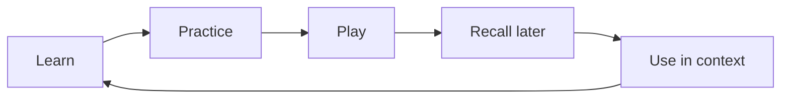
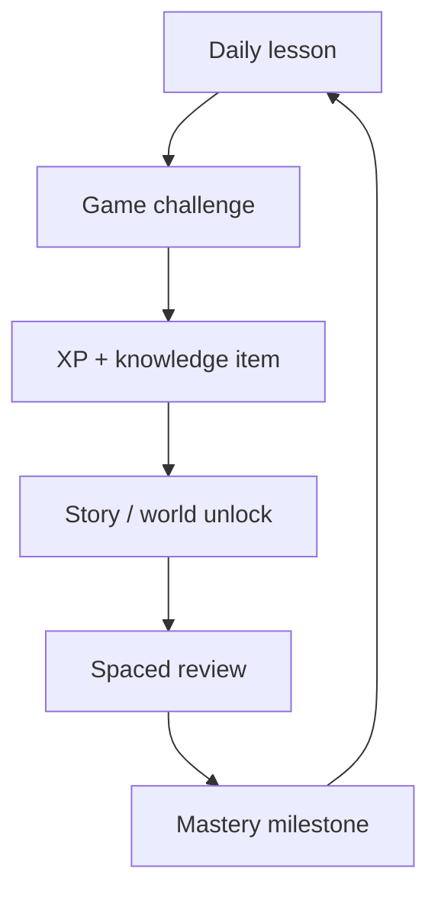
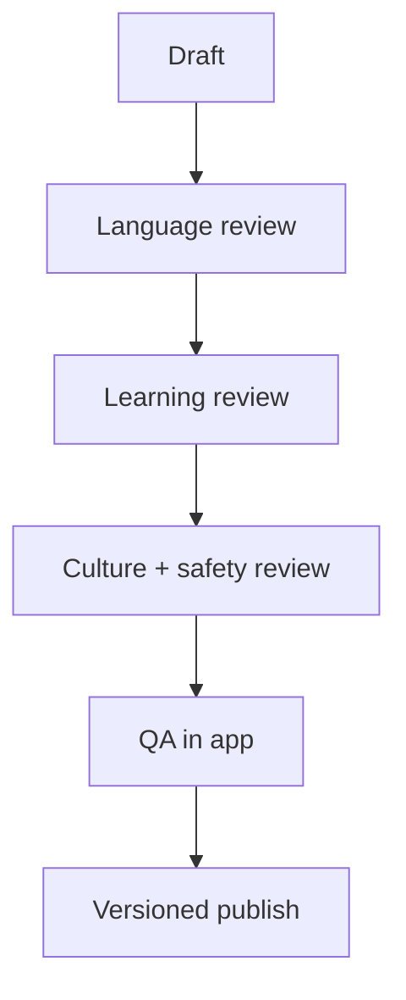
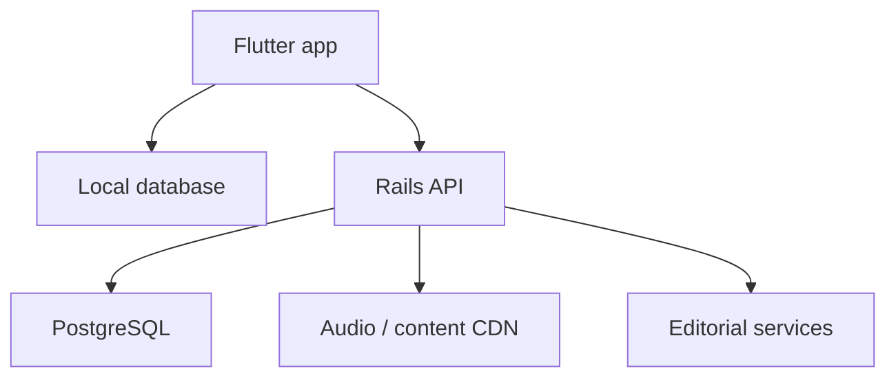

# THUMAL QUEST — MASTER ROADMAP

**Document version:** 1.0  
**Roadmap date:** 13 September 2026  
**Product stage:** Working prototype / pre-production  
**Roadmap horizon:** 9–12 months to a credible public V1; continuous growth thereafter  
**Status:** Living document — phase gate tin zawhah update tûr

> **North-star vision:** Thumal Quest chu word-puzzle app mai ni lovin, Mizo tawng
> zirna, hman ṭhatna leh thangthar hnêna thlen chhawnna atâna **Mizo
> community-owned, game-first learning platform** a ni ang.

---

## 1. Kan thil tum

Thumal Quest-in heng thil pali hi a tih hlawhtlin tum ang:

1. **Mizo tawng dik leh nung vawn:** Standard Mizo thumal, spelling, sentence,
   pronunciation, tawng upa leh culture chu mihring thiamte review hmangin dah.
2. **Zirna tak tak thlen:** Khelhtu chu point chauh neihtîr lovin, thumal hriat,
   ngaihthlak, chhiar, ziak leh sentence-a hman thiamna tihpun.
3. **Khelh nuam leh kir leh duhna siam:** Session tawi, challenge chi hrang,
   story, collection leh mastery loop hmangin rei tak an khelh peih tûr siam.
4. **Mizo khawtlang tâna digital hmanraw siam:** Mizoram, India ram dang leh
   foreign-a Mizo awmte; naupang, nu leh pa, puitling leh Mizo tawng zir duh
   non-Mizo-te pawhin an hman theih tûr.

### Product promise

**“Play a little. Learn something real. Carry Mizo forward.”**  
Mizo tagline: **“Khelh la, zir la, thiam rawh.”**

### Non-negotiable principles

- **Mizo-first:** Interface label English a ni thei; zir tûr core content erawh
  chu Mizo tawng a ni ang.
- **Fun-first, learning-proven:** Game nuam leh learning outcome chu a pahnihin
  teh tûr; pakhat sacrifice lovin.
- **Human-reviewed:** Machine translation hi suggestion chauh; canonical Mizo
  content a nih theih loh.
- **Age-appropriate by design:** Kum 5 mi experience leh adult experience chu
  difficulty chauh danglam ni lovin, interaction, visual, content leh safety
  thlengin a hran ang.
- **Offline-first:** Internet chak lohnaah pawh core lesson leh game a kal thei
  tûr.
- **Safe by default:** Public chat, precise location, child advertising ID leh
  manipulative monetization awm lo.
- **Community accountability:** Thumal leh culture chungchâng decision lian chu
  appointed Mizo reviewers leh educators-in an thlir ang.
- **Accessible and inclusive:** Font, contrast, tap target, audio transcript,
  reduced motion leh low-end phone performance ngaih pawimawh.

---

## 2. Tûna app dinhmun — Baseline 0.3

Tûna Flutter prototype-ah hengte hi a awm tawh:

- Premium-style Home, Learn, Games leh Profile navigation
- English UI labels leh Mizo learning content
- Learning path pathum: **Bulṭan**, **Zirchho**, **Thiamna**
- Game paruk: Picture Match, Spelling, Word Search, Word Chain, Tawng Upa leh
  Crossword
- Hearts, combo, score, accuracy, star leh XP session system
- Device-a progress save, daily goal leh best score
- Structured Mizo seed entries 30, category/difficulty/review status nên
- Offline play; account leh public chat a la awm lo

Hei hi visual leh gameplay prototype atan a ṭha. Public product ni tûr chuan
content volume, learning engine, architecture, audio, accessibility, analytics,
privacy, admin workflow leh real-learner validation tihchangtlun a ngai.

---

## 3. Khelhtu kan tumte

“Kum 5 aṭanga puitling” tih hi app mode pakhat neiha vek tûr tihna a ni lo.
Onboarding-ah **age band + current Mizo level + goal + preferred support
language** thlan tûr a ni ang.

| Learner path | Mamawh ber | Experience design | Content focus |
|---|---|---|---|
| **Early Learner (5–8)** | Mizo chhiar bulṭan | Picture, native audio, tap/drag, text tawi, guardian area | Nî tin thil, family, colour, number, animal, alphabet/sound |
| **Young Learner (9–13)** | Vocabulary leh spelling nghet | Short quest, badge, story, immediate feedback | Reading, spelling, sentence bul, school/culture |
| **Teen (14–18)** | Mizo hman ngamna leh identity | Challenge, narrative, collection, friend-code challenge | Idiom, writing, listening, contemporary/cultural usage |
| **Adult Refresher** | Tawng theihna tharthawh leh tihpun | Placement check, flexible session, explanation chiang | Grammar, formal/informal usage, tawng upa, reading |
| **Diaspora / Heritage** | English aṭanga Mizo zir | English guidance, slow native audio, translational hint | Home conversation, kinship, identity, culture |
| **New-to-Mizo** | Foundation system neiha zir | Guided path, meaning/context, repetition | Survival Mizo, pronunciation, sentence pattern |

### Onboarding result

Khelhtu tin hnenah app-in hengte hi a siam sak ang:

- 3, 5 emaw 10-minute daily goal
- Recommended learning path
- Audio speed leh text support preference
- Age-appropriate theme and challenge density
- Guest profile by default; account/sync chu optional

Child account-a email, real name, location emaw public profile a phût lo ang.

---

## 4. Learning system

### Core learning loop

Game tin chu entertainment chauh ni lovin learning objective nei ang. Thumal
pakhat “mastered” tih theih nân hriat mai bâkah, hun dang leh context dangah
correct recall vawi tam tak a ngai.

### Skill pillars

1. **Vocabulary:** Thumal leh a awmzia
2. **Orthography:** Spelling, vowel/consonant pattern leh word boundary
3. **Reading:** Thumal → sentence → paragraph → story
4. **Listening:** Native-speaker audio hriat hran leh awmzia man
5. **Speaking:** Ngaihthlak chhawn, record-and-compare; automatic scoring chu
   Mizo model quality finfiah hnuah chauh
6. **Sentence building:** Word order, particles, tense/aspect markers leh
   natural expression
7. **Culture and pragmatics:** Kinship, zahawmna, context, tawng upa, hla/thu
   rights-safe excerpts leh nî tin nun

### Internal proficiency levels

Formal CEFR certification anga sawi lovin, product chhûnga **TQ Levels** kan
hmang ang:

| Level | Learner outcome |
|---|---|
| **TQ0 — First Steps** | Common words hriat, picture/audio nên match |
| **TQ1 — Home Mizo** | Nî tin conversation sentence tawi hman |
| **TQ2 — Growing Reader** | Sentence leh story tawi chhiar, spelling hriat |
| **TQ3 — Confident User** | Context hrangah thu sawi/ziak, idiom bul hriat |
| **TQ4 — Culture & Mastery** | Tawng upa, nuanced usage, long-form reading leh composition |

Level mapping hi Mizo educators leh learner pilot data hmanga validate hnuah
chauh public claim siam tûr.

### Adaptive review

- Thumal thar chu lesson-ah introduce
- Game chi hrang 2–3-a practice
- 1 nî, 3 nî, 7 nî, 14 nî, 30 nî hnuah recall review
- Dik lohnaah punitive “fail” lovin, hint leh easier contrast pe
- Dik zêl chu review interval sawn sei; harsat chu nâna context dang nên kir
- Learner dashboard-ah **New / Learning / Strong / Mastered** angin lan

---

## 5. Professional game ecosystem

### A. Core game modes — tihchangtlun tûr

| Game | Learning purpose | Professional upgrade |
|---|---|---|
| Picture Match | Word–meaning association | Native audio, distractor quality, category worlds, timed/relaxed modes |
| Spelling | Orthography recall | Letter tiles, audio prompt, typo-aware feedback, difficulty tiers |
| Word Search | Visual recognition | Curated grids, theme quests, accessibility mode, word explanations |
| Word Chain | Lexical recall | Valid-word dictionary, duplicate guard, solo/co-op turn system |
| Tawng Upa | Idiom and culture | Meaning, context, story card, elder/educator audio |
| Crossword | Recall in context | Authored clues, difficulty grading, daily puzzle, hint economy |

### B. New flagship modes

1. **Listen & Pick** — Native Mizo audio ngaihthlak a, picture/thumal dik thlan.
2. **Sentence Builder** — Word tiles rem khâwm a natural Mizo sentence siam.
3. **Story Quest** — Choice-based story tawi; reading, listening leh culture
   question inkawp.
4. **Conversation Path** — Situation (in, school, market, church/community) ang
   zêla response natural thlan.
5. **Pronunciation Studio** — Native audio slow replay leh self-record;
   AI score chu reliable Mizo speech support a awm hnuah chauh.
6. **Culture Trail** — Place, history, food, custom, festival leh oral tradition
   content reviewed.
7. **Daily Thumal** — Thumal pakhat, audio, example, mini-game pathum.
8. **Family Quest** — Device pakhat hmanga adult/naupang cooperative challenge.

### C. Meta-game: Mizo Journey

Learner-in “map” emaw thematic world kal tlangin lesson leh story unlock ang.
Map hming leh imagery chu cultural reviewer thlîrna hnuaiah siam tûr; district
emaw community representation dik lo, stereotype emaw political sensitivity
awm lo tûr.

### D. Session design

- **Quick Play:** 2–3 minutes
- **Daily Path:** 5–8 minutes
- **Story Session:** 10–15 minutes
- Session tinah clear beginning, progress, result leh natural stopping point
- App close hmanah session state save
- No forced waiting, no energy timer, no pay-to-continue pressure

---

## 6. Engagement leh rei tak khelh peihna

Retention chu screen time sei siam tihna a ni lo. Kan tum chu learner-in nî tin
emaw kar tin nuam ti taka kir leh a, thil tak tak a zir chhohna a ni.

### Healthy retention system

- **Daily quest:** Goal tawi 1–3; learner level ang zêla siam
- **Weekly trail:** Game chi hrang khelh leh mastered items tihpun
- **Streak with grace:** Missed day pakhat avânga progress zawng zawng bo lo
- **Collections:** Thumal, tawng upa, story character, culture card
- **Mystery reward:** Content unlock; gambling-like paid random reward ni lo
- **Personal best:** Mahni record nên inel; global public ranking aia safe zâwk
- **Seasonal events:** Community event content chu reviewer-approved, hun tâwp
  hnuah pawh archive-a zir theih
- **Come-back plan:** Rei tak khel lo tân shame message ni lovin gentle review
- **Choice:** Game mode preferred leh session length thlan theih

### Social design — launch boundary

**V1-ah public chat, public profile, open user-generated content leh child global
leaderboard kan siam lo ang.** Safe social option chu:

- Guardian-created family group
- One-time friend code or classroom code
- Pre-written reaction only
- Asynchronous cooperative goal
- Adult controls and report/block path

### Reward economy

- XP = effort and learning progress
- Stars = round performance
- Knowledge items = content mastered
- Cosmetic unlocks = map/theme/avatar, no performance advantage
- Real-money purchase chu child flow-a direct prompt awm lo; parental gate hnuaiah
  chauh

---

## 7. Mizo content system leh quality governance

### Canonical standard

Launch baseline chu **contemporary Standard Mizo (Duhlian/Lusei-based common
written form)** ni ang. Regional, generational leh spoken variants chu metadata
nen record tûr; variant chu “wrong” tia hnawl ngawt lovin context hrilhfiah
tûr.

### Mizo Language & Learning Council

Public beta hmaa mi 4–6 tal appoint tûr:

- Mizo language lead/editor
- Mizo teacher or curriculum specialist
- Early-childhood educator
- Cultural/history reviewer
- Diaspora/heritage learner representative
- Audio/pronunciation coordinator

Mi pakhat chauh approval-a innghat lo. Launch content item tin chu reviewer pahnih
tal sign-off nei tûr; culturally sensitive item chu cultural reviewer tel tûr.

### Editorial workflow

Item tinah heng metadata hi awm tûr:

- Canonical spelling and normalized search form
- Part of speech, meaning, category and difficulty
- Natural example sentence and English support gloss
- Audio speaker consent, dialect/variant, recording date
- Age suitability and sensitive-content flag
- Source/provenance and copyright/license
- Reviewer names/IDs, review date and revision history
- Game compatibility and common-error distractors

### Content targets

| Milestone | Reviewed words | Sentences | Native audio | Stories | Playable items |
|---|---:|---:|---:|---:|---:|
| Phase 0 pilot pack | 100 | 40 | 30 | 1 | 150+ |
| Internal alpha | 500 | 200 | 250 | 5 | 600+ |
| Community beta | 1,200 | 500 | 700 | 15 | 1,500+ |
| Public V1 | 3,000 | 1,000 | 1,500 | 40–50 | 3,500+ |
| Long-term library | 5,000+ | 2,500+ | 3,000+ | 100+ | Continuous |

Number hi quality aiin pawimawh zâwk lo. Reviewed content target tling loh chuan
release date sawn aia unreviewed content publish loh hi kan thlang ang.

### Google Cloud hman dân

Google Cloud Translation documentation-in **Mizo (`lus`)** a support tih a ziak.
Thumal Quest-ah:

- English support gloss draft siam nân backend-a optional tool angin hmang
- Canonical spelling, definition, sentence emaw pronunciation source-ah hmang lo
- Translation output chu `unreviewed` status-a dah; mihring reviewer approve hnuah
  chauh app-ah publish
- Service-account/API credential chu Flutter app-ah embed lo
- Cost cap, rate limit, audit log leh delete policy nei
- Speech-to-Text/Text-to-Speech chu official Mizo quality/support finfiah hma chuan
  learning score emaw native pronunciation substitute-ah hmang lo

Native-speaker recording hi pronunciation source ber a ni ang.

---

## 8. UX/UI product standard

### Design direction

- Premium, warm, modern; “school worksheet” ang lo
- Mizo-inspired colour/pattern chu cultural respect nên, decorative overload lo
- English navigation labels: **Home, Learn, Games, Profile**
- Mizo core copy, English explanation thlan theih
- Responsive phone/tablet; landscape puzzle support
- One-handed primary actions; clear back/quit confirmation

### Age-responsive UX

| Area | Ages 5–8 | Ages 9–13 | Teen/adult |
|---|---|---|---|
| Reading load | Very low | Short instruction | Full explanation optional |
| Tap target | 52–64 dp | 48–56 dp | ≥48 dp preferred |
| Feedback | Audio + visual | Visual + short text | Detailed correction |
| Session | 2–5 min | 5–8 min | 5–15 min |
| Reward | Character/world | Badge/collection | Mastery/stats/story |
| Controls | Guardian-gated | Safe defaults | Full settings |

### Accessibility definition of done

- Text scaling 200% thleng layout chhia lo
- Good contrast; colour chauh hmanga correct/wrong sawi lo
- Screen-reader semantic labels
- Audio tin transcript nei
- Sound, haptic leh animation off/reduce theih
- Dyslexia-friendly spacing option research/test
- Timed mode optional; learner core progression tân timing a phût lo

---

## 9. Technology master architecture

Flutter chu Android leh iOS app pahnih codebase pakhat hmanga siam tûr a ni zêl.
Production scale tân feature separation leh offline repository pattern kan hmang
ang.

### Flutter client

- UI layer: Views + ViewModels/controllers
- Domain layer: learning schedule, mastery, scoring, game rules
- Data layer: repositories as single source of truth
- Services: local database, secure API, download, audio, analytics
- Feature modules: onboarding, learn, games, story, profile, guardian
- Local database package chu Architecture Decision Record (ADR)-ah benchmark
  hnuah thlan
- Downloadable, signed and versioned content packs
- Guest-first; optional account and encrypted sync later

Flutter official architecture guide-in UI leh data layers then hran, repository
leh service responsibilities chiang taka siam a recommend. Official offline-first
guide pawhin repository-in local leh remote source a combine tûr tih a sawi.

### Backend and admin

**Ruby on Rails API + PostgreSQL** hi content/editor workflow tân a remchâng:

- Users/guardians and optional sync
- Content model, revision, reviewer approval and release channels
- Audio metadata and signed upload
- Classroom/family codes
- Feature flags and minimum app/content version
- Privacy request: export/delete
- Admin role permissions and audit trail

Audio/image chu object storage + CDN; database-ah metadata chauh. Rails chu game
rendering engine ni lo—Flutter-in game render ang; Rails-in data, review, sync leh
operations a enkawl ang.

### Reliability and delivery

- Git repository + protected main branch
- CI: format, static analysis, unit/widget/integration tests
- Android/iOS build smoke test release tinah
- Crash-free sessions and startup performance monitor
- Dev / staging / production environments hran
- Secrets server/CI secure store-ah; repo/client-ah dah lo
- Feature flag hmangin beta feature gradual rollout
- Daily database backup; restore drill quarterly

### Quality targets for public V1

- Crash-free sessions ≥99.5%
- Warm start p95 ≤2 seconds on supported mid-range device
- Core games usable fully offline
- Content sync interrupted pawhin existing pack chhe lo
- Automated unit/widget coverage for critical domain rules ≥80%
- Zero known critical/high security defect at release gate

Targets hi device pilot hnuah refine tûr.

---

## 10. Child safety, privacy leh store readiness

Google Play-ah children target audience a tel chuan Families requirements a
apply; target ages dik taka declare, child data collection disclose, approved
SDK/data practice leh applicable law zawm a ngai. Apple Kids Category-ah external
link, purchase leh distraction chu parental gate hnuaiah dah tûr a ni a,
third-party analytics/advertising chungchângah khauh takin a enkawl. U.S.-a child
under 13 personal data khawnnaah COPPA requirements a awm.

### Product decision

- **Ads-free at least through V1**; child experience-ah personalized ad reng reng
  awm lo
- Neutral age/experience setup; birth date exact khawn loh theihna research
- Underage profile local-first and pseudonymous
- Microphone permission chu speaking feature hawn hunah, clear purpose nên chauh
- Camera, contacts and precise location permissions nei lo
- External links, account creation, purchase and data controls behind parental
  gate for child path
- Public chat and free-form sharing nei lo
- Privacy policy in plain English + Mizo summary
- Data minimization, retention schedule, export/delete path
- SDK tin child-directed use, data flow leh terms review
- Store submission hmaa specialist/legal review (market hmun ang zêla)

Policy compliance hi legal advice substitute a ni lo; release market tina
applicable law check tûr.

---

## 11. Community ownership leh partnership

### Governance

- Quarterly Language Council meeting
- Public correction/report form; report status track theih
- Community submission chu moderation queue-ah chauh; direct publish lo
- Change log-ah spelling/meaning revision hrilhfiah
- Contributor consent and license clear
- Sensitive cultural content tân named custodian/reviewer

### Pilot network

Beta-ah group pathum tal:

1. Mizoram-a primary/secondary learners and teachers
2. India ram danga Mizo families
3. Overseas Mizo family/community group

Each group-ah device, age, Mizo proficiency leh home-language pattern danglam
sample tûr. Naupang research chu guardian consent leh privacy-safe observation
hmanga kalpui tûr.

### Institution opportunities

- School and Sunday-school/community class offline packs
- Mizo language departments, teachers and authors content partnership
- Community audio-recording days
- Diaspora associations pilot and sponsorship
- Annual reviewed “Mizo Language Pack” release

---

## 12. Sustainability leh monetization

V1 hmaa retention leh learning value finfiah phawt; monetization-in child trust a
tihchhiat tûr a ni lo.

### Recommended model

- Core vocabulary, early learner path and daily practice: **free forever**
- No advertising to children
- Optional **Family Supporter** subscription: extra story packs, family insights,
  multi-device sync; core learning paywall lo
- One-time culture/story pack for adults where appropriate
- School/community license: admin dashboard and class pack, learner core app free
- Grants, diaspora sponsorship and institutional partnership
- Sponsor credit chu content nên inang lova clear taka dah

### Never do

- Loot box / paid random reward
- Streak chhanhim nâna child pressure purchase
- Learning failure avânga payment wall
- Personal data sale
- Ad-like sponsor placement game answer chhûngah

---

## 13. Success metrics

### North Star Metric

**Weekly Mastered Mizo Items (WMMI):** Kar khata active learner-ten
human-reviewed thumal/sentence/audio item engzât nge spaced recall-ah an master.

Hei hian raw screen time aiin zirna leh engagement a pahnihin a teh.

### Metric scorecard

| Area | Metric | Community-beta target |
|---|---|---:|
| Activation | Onboarding + first learning round complete | ≥70% |
| Learning | Assigned round completion | ≥75% |
| Learning gain | 4-week pre/post pilot improvement | ≥20% relative improvement |
| Retention | Day-7 return | ≥25% |
| Habit | Active learner weekly sessions median | ≥3 |
| Quality | Crash-free sessions | ≥99.5% |
| Content | Published items with required review | 100% |
| Trust | Confirmed content error per 1,000 plays | <1, then trend downward |
| Accessibility | Critical flows pass manual a11y checklist | 100% |
| Safety | Known critical child-safety defect | 0 |

Targets chu first pilot baseline hnuah adjust theih. Naupangte tâna “time spent”
sei ber nih chu success metric-ah kan dah lo ang.

### Analytics event minimum

- onboarding_started/completed
- placement_started/completed
- lesson_started/completed
- game_started/completed/abandoned
- item_answered (no free-form child text)
- hint_used
- review_due/completed
- content_error_reported
- audio_played
- sync_succeeded/failed

Age band chu broad bucket; exact date of birth leh personal content analytics-ah
dah lo. Child-safe analytics decision a la tlin hma chuan local aggregate chauh.

---

## 14. MASTER PHASE ROADMAP

Timeline hi full-time small team emaw disciplined solo + specialist contributor
hmanga estimate a ni. Phase gate quality tling loh chuan calendar aia gate kan
zawm ang.

### Phase 0 — Foundation & Validation Sprint (2–3 weeks)

**Goal:** Product, Mizo content leh code foundation chiang taka lock.

**Deliverables**

- Product Requirements Document (PRD) and learner personas
- Age/level/goal onboarding flow specification
- Mizo content schema v2 + editorial guide + reviewer workflow
- Language Council member/role confirmation
- Flutter architecture ADR and project restructuring plan
- Game Session Engine v2 specification shared by all games
- 100-word/40-sentence reviewed pilot pack + 30 native audio
- 15–20 key-screen high-fidelity UX flow
- Mac/Android/iOS reproducible build instructions + CI baseline
- Privacy/data inventory v0

**Exit gate**

- Fresh Mac setup can build and run without manual source edits
- App scope, priority launch learner and non-negotiables approved
- At least two Mizo reviewers approve the pilot content process
- English UI/Mizo learning-content rule documented
- Six current games mapped to explicit learning outcomes
- No unresolved critical architecture or child-data decision

### Phase 1 — Professional Core (4–6 weeks)

**Goal:** Prototype code chu production-ready core-ah siam.

**Deliverables**

- Feature-based Flutter architecture: UI/domain/data/services
- Local database and repository migration
- First-run onboarding, guest profiles and age-responsive settings
- Game Session Engine v2: pause/resume, deterministic rounds, hints, results
- All six games refactor + tutorial + relaxed/timed options
- Accessibility pass for navigation and games
- Local-safe analytics event model
- Automated tests and CI build checks
- Content pack version/checksum system

**Exit gate**

- 30-minute exploratory play: no blocker/crash/data loss
- Progress remains correct across force-close/restart
- Core game rules have automated tests
- Screen reader/text scaling critical flows pass
- 500 internally reviewed words target ready or scheduled

### Phase 2 — Learning Engine & Audio (5–7 weeks)

**Goal:** Khelhna chu measurable language-learning system-ah chantîr.

**Deliverables**

- Placement check and TQ0–TQ4 path
- Spaced repetition scheduler and mastery states
- Adaptive difficulty and common-error feedback
- Listen & Pick and Sentence Builder games
- Native audio player, slow replay and transcript
- Daily lesson generator and review queue
- Learner progress dashboard focused on skills, not hours
- Content error-reporting path

**Exit gate**

- Learner thumal thar → practice → later recall full loop a kal
- Offline review queue and audio pack work
- Difficulty adapts without trapping learner
- Audio consent/provenance complete for every published clip
- 10+ learners per priority segment usability-tested

**Phase 2A implementation checkpoint — 13 September 2026**

- TQ0–TQ4 placement, mastery state and spaced-repetition domain implemented
- SQLite/preferences learning-state persistence and migration implemented
- Offline due-first Daily Lesson and adaptive-level baseline implemented
- Skill-focused Learn dashboard implemented
- Mac analyzer/test/native verification required for build 0.6.1+12
- Audio, Listen & Pick and Sentence Builder remain in Phase 2B

**Phase 2B implementation checkpoint — 13 September 2026**

- Listen & Pick and Sentence Builder implemented on the resumable Game Engine V2
- Native asset player, slow replay, transcript and audio provenance UI implemented
- Game answers now update Phase 2A mastery and spaced-repetition state
- Local content issue reporting implemented with stable content IDs and reasons
- Audio publication fails closed without speaker consent, rights and two reviews
- Build 0.7.0+13 requires Mac analyzer/test/native verification
- Native-speaker recording production and priority-segment learner tests remain release gates

**Phase 2C operational checkpoint — 13 September 2026**

- Ten-clip recording manifest and consent/review handoff implemented
- Strict WAV, checksum, consent, licence and dual-review audio gate implemented
- Anonymous three-segment learner scorecard and quantitative exit gate implemented
- Build 0.7.1+14 requires Mac technical verification
- Honest evidence baseline: 0/10 reviewed clips and 0/30 learner sessions
- Phase 2 exit remains pending until Mac, audio and learner strict gates pass

> Phase 1C implementation note (13 September 2026): reproducible Mac
> preflight, diagnostics and macOS/Android/iOS native smoke gates are authored.
> Phase 1 remains device-gate pending until the authoritative Mac check,
> accessibility audit and 30-minute stability session produce real evidence.

### Phase 3 — World, Story & Long-term Engagement (6–8 weeks)

**Goal:** Khelhtu kir leh duh tûra meaningful adventure siam.

**Deliverables**

- Mizo Journey map/world and collection system
- Story Quest and Conversation Path
- Daily/weekly quests and streak grace
- Culture Trail and Tawng Upa context cards
- Age-responsive avatar/cosmetic rewards
- Gentle comeback flow and healthy stopping points
- Seasonal content framework without manipulative FOMO

**Exit gate**

- Four-week internal cohort-in content repetition excessive lo tia report
- Narrative/culture content Language Council approved
- Core learning is never blocked by currency/payment
- Child and adult paths feel intentionally different in usability review

**Phase 3A implementation checkpoint — 13 September 2026**

- Three-region Mizo Journey map and prerequisite/TQ-level progression implemented
- Three Mizo-first branching Story Quests with optional English support implemented
- Local daily/weekly quest progress, one-day streak grace and gentle comeback implemented
- Culture-card collection and child/adult-specific reward labels implemented
- Healthy stopping point and non-manipulative engagement rules implemented
- Build 0.8.0+15 requires Mac technical verification
- Honest review baseline: 0/3 language-approved and 0/3 culture-approved stories
- Phase 3 exit remains pending until strict story review and four-week cohort gates pass

**Phase 3B implementation checkpoint — 13 September 2026**

- Six-card Mizo Culture Trail with context, examples and English support implemented
- Collection milestones, Trail Marks and age-responsive avatar selection implemented
- Daily/weekly recognition claims are idempotent and never block core learning
- Chapchar Kut seasonal trail remains available through a no-deadline archive
- Four-week, three-segment engagement evidence contract and strict gate implemented
- Build 0.9.0+16 requires Mac technical verification
- Honest baseline: 0/6 approved cards, 0/15 participants and 0/60 weekly rows
- Phase 3 exit remains pending until story/culture, cohort and Mac gates pass

**Phase 3C implementation checkpoint — 13 September 2026**

- Gentle engagement is default-on and suppresses streak-pressure presentation
- Exact 19-decision reviewer queue and safe manifest-promotion workflow implemented
- Eight-control community-pilot safety/readiness gate implemented
- Successful Mac checks now produce structured, version-bound evidence
- One aggregate strict gate covers review, pilot, cohort, content and Mac evidence
- Build 0.9.1+19 requires authoritative Mac verification
- Honest baseline: 0/19 approvals, 1/8 pilot controls and no Mac evidence
- Phase 3 remains open until real reviewers, learners, pilot owners and Mac pass it

### Phase 4 — Backend, Editorial Studio & Community Beta (5–7 weeks)

**Goal:** Content siam, review, publish leh optional sync professionally enkawl.

**Deliverables**

- Rails API + PostgreSQL staging deployment
- Role-based Editorial Studio and audit history
- Content review/publish channels and rollback
- Signed audio upload + CDN delivery
- Optional account/sync; guest migration flow
- Guardian/family group and safe challenge prototype
- Closed beta 100–300 learners across at least three cohorts
- Support, feedback, crash and content-error triage process

**Exit gate**

- No unreviewed item can reach production release channel
- Offline app survives backend outage
- Account delete/export tested
- Beta targets reviewed; critical issues closed
- Privacy and threat-model review completed

**Phase 4A implementation checkpoint — 13 September 2026**

- Build 0.10.0+20 introduces a Rails 8.1 + PostgreSQL Editorial Studio
- Role-separated editing, language/culture decisions and publishing implemented
- Author self-review and same-person dual approval are blocked server-side
- Approved full-snapshot packs are immutable, checksummed and safely rollbackable
- Public V1 pack API supports ETag while Flutter remains fully offline-first
- Editorial staff identity/audit is the only new server data; no learner data
- Rails security/style/test CI, Docker staging definition and Mac runner added
- Runtime Rails/Flutter gates and real staging drill remain pending evidence

### Phase 5 — Store Launch Readiness (3–5 weeks)

**Goal:** Google Play leh Apple App Store-a trustworthy V1 release.

**Deliverables**

- Bundle IDs, signing, release build and CI/CD
- Privacy policy, terms, support and data-deletion pages
- Store age/target-audience declarations and data-safety forms
- App icon, screenshots, preview, description and localization
- Device matrix, performance, accessibility and offline QA
- Security review, dependency/SDK inventory and release checklist
- Phased rollout + rollback plan
- Community launch communications and reviewer credits

**Exit gate**

- Zero open critical/high defects
- 100% published content has required approvals
- Crash-free target met in release candidate cohort
- Store-policy/legal checklist signed off
- Support owner and incident response route active

### Phase 6 — Public V1 & Learning Validation (first 8–12 weeks after launch)

**Goal:** Real usage aṭanga learning leh retention finfiah, stable growth.

**Deliverables**

- 5–10% → 25% → 100% staged rollout
- Weekly metric/content-quality review
- Four-week learning-outcome study
- Top learner pain points and dropout funnel fixes
- New reviewed content pack every 2–4 weeks
- Family Quest refinement and classroom pilot design

**Exit gate**

- D7, completion, WMMI and crash-free metrics stable
- Content correction SLA functioning
- Community trust/feedback report published
- Phase 7 priorities chosen from evidence, not assumptions

### Phase 7 — Scale & Ecosystem (ongoing)

Possible tracks, data and community demand ang zêla:

- Classroom/teacher dashboard
- Family learning plan and cross-device sync
- Advanced reading/writing and essay feedback
- Additional dialect/variant packs with named reviewers
- Creator contribution workflow with strict moderation
- Safe asynchronous community events
- Speech research partnership for Mizo recognition/synthesis
- Web companion and institutional deployment

Open chat, real-time multiplayer, AI conversation bot emaw competitive global
leaderboard chu safety, moderation, cost leh learning evidence awm hnuah chauh
consider tûr.

---

## 15. Priority backlog

### MUST — Public beta hmaa awm ngêi tûr

- Reproducible run/build and CI
- Learner segmentation/onboarding
- Content schema, review states, provenance and two-reviewer gate
- Native audio foundation
- Local database + offline-first repository
- Spaced review/mastery engine
- Accessible game tutorials and feedback
- Privacy/data inventory, parental gate and no-public-chat boundary
- Content report/correction workflow
- Beta analytics without child personal data

### SHOULD — Public V1 value lian

- Story Quest and Sentence Builder
- Mizo Journey/collection
- Daily/weekly goals with streak grace
- Optional sync and family profiles
- Editorial Studio and remote content packs
- Culture Trail and expanded Tawng Upa
- Community beta across Mizoram and diaspora

### LATER — Evidence hnuah

- Classroom dashboard
- Speech recognition scoring
- User-created puzzles
- Real-time multiplayer
- Public leaderboard/social feed
- Generative AI conversation

---

## 16. Risk register

| Risk | Impact | Mitigation |
|---|---|---|
| Mizo spelling/meaning dik lo | Trust and learning damage | Two-reviewer gate, provenance, correction SLA, version history |
| Scope a zau lutuk | Release rei, quality tla | Phase gates, priority learner first, MUST/SHOULD/LATER |
| Content siam chak lo | Repetition, retention tla | Editorial calendar, author tools, recording days, reusable templates |
| All-ages UX generic | Naupang leh adult tu mah tân perfect lo | Segmented onboarding and age-responsive experiences |
| Engagement > learning | Khelh rei mahse thiamna pung lo | WMMI, spaced recall, pre/post learner study |
| Child privacy/policy violation | Trust, legal and store risk | Data minimization, no ads/chat, parental gates, SDK audit, legal review |
| Machine translation error | Canonical Mizo tihsual | Draft-only backend use, mandatory human approval |
| Solo/team capacity | Burnout and fragile code | Small phase scope, automation/CI, clear council roles |
| Low-end device/network | Accessibility tla | Offline-first, compressed packs, performance/device QA |
| Audio rights/quality | Release block | Written consent/license, recording standard, metadata and retake QA |
| Funding pressure | Child-unfriendly monetization | Grants/supporter model, core free, explicit ethical boundary |

---

## 17. Team and ownership

| Role | Main accountability |
|---|---|
| Product owner | Vision, scope, priority and final product decision |
| Flutter engineer | App architecture, games, offline data, release builds |
| Rails/backend engineer | Editorial API, database, sync, security, operations |
| Mizo language lead | Canonical content and reviewer resolution |
| Learning designer/teacher | Age fit, lesson sequence, assessment |
| UX/product designer | Research, flows, design system, accessibility |
| Audio coordinator | Speaker consent, recording, editing and metadata |
| QA/community lead | Device testing, beta cohorts, feedback triage |

Mi pakhatin role eng emaw zat a keng thei; mahse sign-off responsibility chu
document-a a hranin dah tûr.

---

## 18. Decision register

### Already decided

- Product name: **Thumal Quest**
- Flutter mobile app; Android + iOS first
- English primary navigation labels; Mizo learning content
- Learners from age 5 through adults, diaspora included
- Game-first and offline-first
- Human-reviewed Mizo; Google Cloud output canonical source ni lo
- No public chat in launch scope
- Premium/professional visual and game quality

### Phase 0 approved — 13 September 2026

- Priority V1: Ages 8–13 + diaspora beginners
- Audience path: Mixed audience with child-safe defaults
- Account: Guest-first; optional cloud sync later
- Sustainability: Ads-free through V1; core learning free
- Technology: Flutter offline-first; Rails Editorial Studio in Phase 4
- Social: No public chat, public profile or global child leaderboard in V1

Authoritative record: `PRODUCT_DECISION_RECORD.md`.

### Phase 0-a la decide ngai

1. Language Council-ah tute nge, final spelling dispute tu nge resolve?
2. First 100 words leh curriculum sequence tu nge approve?
3. Audio recording hmun, speakers, consent and compensation eng nge?
4. Backend hosting, budget cap and operations owner tu nge?

---

## 19. Phase 0 — active sprint

**Foundation & Validation Sprint** hi tan tawh a ni. Product defaults PDR-001-a
approve a ni tawh; human Mizo review, audio, learner test leh real Mac build
evidence la khâwm mêk a ni.

### Sprint workstreams

1. **Product:** PRD, priority learner, success metrics, scope boundary
2. **Language:** Content schema v2, editorial guide, 100-word pilot review
3. **Learning:** TQ levels, lesson loop, game-to-skill mapping
4. **UX:** Onboarding + Learn/Game/Profile full flow prototype
5. **Engineering:** Architecture audit, run/build fix, Session Engine v2 spec, CI
6. **Trust:** Child-data map, parental gate, policy checklist

### Phase 0 completion package

- `PRODUCT_REQUIREMENTS.md`
- `LEARNER_PERSONAS.md`
- `CONTENT_EDITORIAL_GUIDE.md`
- `CONTENT_SCHEMA_V2.md`
- `ARCHITECTURE_ADR.md`
- `GAME_ENGINE_V2_SPEC.md`
- High-fidelity UX flow
- Reviewed pilot content/audio pack
- Working CI and Mac setup validation report

**Next phase command:** “Phase 0 tan rawh” tih a nih chuan, workstream 1–6 hi
order-a kalpuiin, deliverable tin source project-ah siam leh test tûr.

---

## 20. Official references used

- [Flutter — Guide to app architecture](https://docs.flutter.dev/app-architecture/guide)
- [Flutter — Offline-first support](https://docs.flutter.dev/app-architecture/design-patterns/offline-first)
- [Google Play — Families Policies](https://support.google.com/googleplay/android-developer/answer/9893335)
- [Apple — App Review Guidelines](https://developer.apple.com/app-store/review/guidelines/)
- [FTC — Children’s Online Privacy Protection Rule](https://www.ftc.gov/legal-library/browse/rules/childrens-online-privacy-protection-rule-coppa)
- [Google Cloud Translation — Language support](https://docs.cloud.google.com/translate/docs/languages)

---

## Phase 4B checkpoint — implemented 13 September 2026

Content/audio pack delivery, signed production media upload, two-person audio review, immutable releases, rollback and checksum-verified atomic Flutter offline sync are implemented in build `0.11.0+21`. Technical sign-off remains conditional on `run_backend.command check`, `run_mac.command check`, staging object-store/CORS validation and a real reviewed Mizo recording drill. Phase 4C may begin only after those gates pass.

## Phase 4C checkpoint — source-complete 13 September 2026

Build `0.12.0+22` adds dependency-aware Railway readiness, production S3 fail-closed configuration, live manifest/audio integrity smoke, real five-clip pilot evidence, device failure/rollback drills and a strict exit gate. External staging, speaker consent, independent reviewer, backup restore and physical-device evidence remain pending until actually performed. Phase 5 cannot begin on structural evidence alone.

## 21. Roadmap review cadence

- Weekly during active development: phase task and risk update
- Phase gate tinah: scope, metric and decision register review
- Monthly: Language Council/content quality review
- Quarterly after launch: product strategy, learning evidence and safety audit

Roadmap change tinah **date, decision owner, reason and impact** record tûr.
Feature thar chu vision nên a inmil em, real learner problem a solve em, Mizo
tawng learning a ṭanpui em, safe em, measure theih em tih zawhna panga a pass
hnuah chauh backlog-ah dah tûr.
