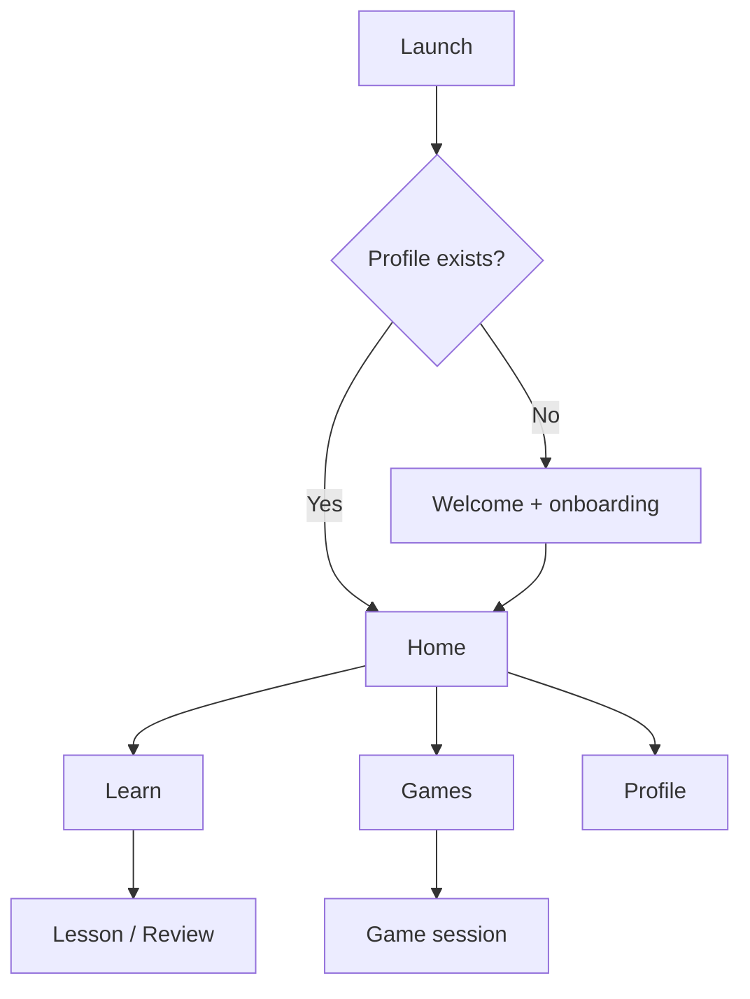

# Hnahsin — UX Product Flow

**Version:** 0.1 / Phase 0 design handoff  
**Visual direction:** Premium, warm, game-first, age-responsive  
**UI language:** Natural English labels; Mizo learning content

This document defines 20 key screens and their interaction/state requirements.
It is the Figma/Flutter handoff source for Phase 1. Existing V0.3 design tokens
remain the visual baseline until learner testing changes them.

## 1. Product navigation

Bottom navigation after onboarding: **Home, Learn, Games, Profile**. Guardian
area is reached from Profile/Settings behind adult action, not a fifth child tab.

## 2. Experience modes

| Mode | Learner | UI density | Session | Reward tone |
|---|---|---|---|---|
| Sprout | 5–7 | Very low, picture/audio | 2–4 min | Character/world |
| Explorer | 8–13 | Medium, short text | 5–8 min | Quest/collection |
| Journey | 14+ | Flexible, richer explanation | 5–15 min | Mastery/story/stats |

Mode names are working labels and require user testing. They are not visible
age labels intended to embarrass older beginners.

## 3. Key screens

### Screen 01 — Splash / safe startup

**Purpose:** Brand and fast local initialization.  
**Content:** Logo, “Khelh la, zir la, thiam rawh.”, discreet loading state.  
**States:** ready, local migration, recoverable data error.  
**Rule:** No ad, permission prompt or network dependency. Target transition ≤2s
warm start.

### Screen 02 — Welcome

**Title:** Learn Mizo through play  
**Mizo support:** Khelh pahin Mizo tawng zir rawh.  
**Actions:** Get Started; “I already have a profile” only after sync exists.  
**Visual:** Premium Mizo Journey illustration/pattern; one clear CTA.

### Screen 03 — Choose learner experience

**Question:** Who is learning?  
**Options:** Ages 5–7, Ages 8–13, Ages 14–17, Adult.  
**Privacy:** Explain that only a broad group is saved; exact birthday not asked.  
**Child UX:** Adult/guardian may complete setup.

### Screen 04 — Current Mizo level

**Question:** How much Mizo do you know?  
**Options:** I’m new; I understand some; I can speak; I can read and write.  
Each card has one plain-language example; never use exam jargon.

### Screen 05 — Learning goal

**Question:** What would you like to focus on?  
**Options:** Home conversation, Words & spelling, Reading, Culture, Refresh my
Mizo. Multi-select maximum two initially.

### Screen 06 — Support and accessibility

**Controls:** English help on/off, sound default, text size preview, reduced
motion.  
**Rule:** Audio permission is not requested; playback needs none.

### Screen 07 — Placement choice

**Options:** Take a 2-minute check; Start from the beginning.  
**Rule:** Early Learner defaults to beginning; placement is never called a test.

### Screen 08 — Placement round

Three to eight adaptive items using picture, word and optional listening.  
Progress shows item count, not pass/fail. Exit saves no false mastery.

### Screen 09 — Path ready

Shows recommended TQ level, first goal and selected experience.  
**CTA:** Start First Quest.  
Edit choices available without restarting onboarding.

### Screen 10 — Home

Hierarchy:

1. Brand/profile status and offline indicator when relevant
2. Continue Quest hero with 3/5/10-minute goal
3. Reviews due
4. Daily challenge
5. Recommended games/story

No crowded carousel and no purchase prompt in child mode.

### Screen 11 — Learn path

World/lesson nodes show locked/current/completed/mastered. Each node exposes:

- Objective: what learner will know/do
- Estimated time
- New vs review item count
- Audio/download state
- Replay option after completion

Locked node explains prerequisite; no opaque currency requirement.

### Screen 12 — Lesson introduction

Introduces 3–7 items depending on mode. Each item may show picture, Mizo form,
audio, Mizo definition/context and optional English support.  
**Actions:** Listen, Slow, Continue; no “memorized” self-claim required.

### Screen 13 — Review queue

**Title:** Ready to Review  
Groups due items into 2/5/10-minute options. Shows supportive copy if overdue.
Learner can choose review mode; due count is not anxiety-red.

### Screen 14 — Games library

Filters: Recommended, Quick, Words, Listening, Reading, Culture.  
Card shows objective, length, mode, download state and personal best.  
“Locked” means learning prerequisite/content download only, not purchase in core
path.

### Screen 15 — Game preview/tutorial

Before first play or on Help:

- One-sentence objective
- Animated/static example with accessible alternate
- Relaxed/Standard/Timed choice where available
- Sound and difficulty summary
- Start button

Returning learner can skip.

### Screen 16 — Active game

Persistent elements:

- Back/pause
- Progress count/bar
- Optional hearts only in challenge mode
- Score secondary to prompt
- Large interaction area
- Audio replay/transcript where relevant

App background saves snapshot. Back asks Save & Exit / Keep Playing.

### Screen 17 — Answer feedback

Feedback appears near answer without layout jump:

- Correct/Not yet icon + text
- Canonical answer and natural explanation
- Optional English support
- Audio replay
- Continue/Try Again

Wrong answer never uses harsh sound, shame copy or colour alone.

### Screen 18 — Session result

Shows:

- What was learned/reviewed
- Accuracy and hint use
- Mastery changes
- XP/collection unlock
- Next recommended action

Buttons: Continue Path, Play Again, Home. Share is not default child action.

### Screen 19 — Profile / progress

Tabs or sections:

- TQ level and weekly mastered items
- Skill map: Words, Spelling, Reading, Listening, Sentences, Culture
- Collections/personal best
- Goal/settings

Avoid child public rank and maximum-time celebration.

### Screen 20 — Guardian & privacy

Behind parental gate for child mode:

- Local profiles and broad age experience
- Sound/accessibility controls
- Optional account/sync status
- Data summary, export/delete
- External support/privacy links
- Purchase controls only if later introduced

No dark pattern in gate; it prevents accidental child action, not informed adult
access.

## 4. Critical flows

### First-time value flow

Welcome → age experience → level → goal → optional placement → first lesson →
result → Home. Target ≤60 seconds to first interactive learning item when
placement is skipped.

### Daily return flow

Home → Continue Quest/Review → mixed 5-minute session → result → clear stopping
point.

### Offline flow

Launch → bundled/active local pack → play/learn/save → subtle Offline status.
Network error does not interrupt core play. Content update waits safely.

### Content-error flow

Item menu → Report a problem → choose predefined category → optional adult text
only where safe → confirmation ID. Child is not asked for contact details.

### Interrupted session flow

Background/close → local snapshot → reopen → Resume Quest or Start Over. Already
committed attempts remain; reward cannot duplicate.

## 5. Component inventory

- App shell and accessible floating navigation
- Onboarding option card
- Age-responsive page header
- Continue Quest hero
- Lesson path node
- Content/audio card
- Game card and mode chip
- Session HUD
- Answer tile states
- Teaching feedback panel
- Result/mastery sheet
- Offline/download status
- Guardian gate
- Error/report sheet
- Empty/loading/recovery states

Each component needs default, pressed, focused, disabled, loading, error and
large-text states where applicable.

## 6. Responsive rules

- Phone portrait is primary.
- Tablet content max-width 720–840 px; never stretch text/puzzle full width.
- Crossword/Word Search can use landscape but cannot require it without notice.
- Bottom nav respects safe area.
- Keyboard opening keeps prompt/submit visible.
- 200% text uses reflow/scroll; no clipped fixed-height text card.

## 7. Motion and sound

- Motion confirms action/progress; duration usually 150–300ms
- Reduced-motion removes scale/large travel, not state feedback
- Correct sound warm/short; incorrect sound neutral
- Sound and haptic separately toggleable
- No autoplay voice during quiet launch
- Essential audio always has transcript/replay

## 8. Copy standards

| UI function | English label | Mizo learning/support example |
|---|---|---|
| Main tabs | Home, Learn, Games, Profile | — |
| Primary next | Continue | Chhunzawm rawh |
| Retry | Try Again | Tum leh rawh |
| Audio | Listen / Slow | Ngaithla rawh |
| Hint | Hint | Thûkru / hint wording requires review |
| Success | Nice work! | I ti thei e! |
| Correction | Not yet — try this | A la dik lo — hei hi en teh |

Exact Mizo feedback copy requires language/age review before release.

## 9. Usability protocol

For each priority persona:

1. Find first lesson without help
2. Explain what the lesson teaches
3. Complete one correct and one incorrect item
4. Find/replay audio
5. Exit and resume
6. Find learned/mastered progress

Capture task completion, hesitation, mis-taps and learner’s own explanation.
Do not collect unnecessary child video/voice; obtain guardian consent.

### Phase 0 pass thresholds

- 80%+ find first lesson without facilitator instruction
- 90%+ identify correct next action after feedback
- 100% can exit without accidental data/purchase action
- No critical accessibility blocker
- Child and adult participants both describe visual as appropriate/comfortable

